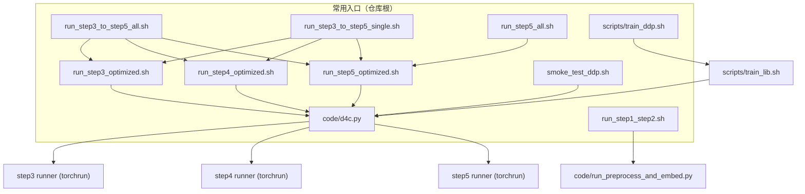

# D4C 脚本与运行期综合指南

## 文档更新说明

- **整合日期**：2026 年 3 月 28 日  
- **作用**：本文档为仓库内 **唯一维护** 的脚本速查、Shell/Python 分工、路径与 checkpoint/日志约定、`DDP_NPROC` 与 `D4C_NUM_PROC` 辨析、外置 YAML 预设与配置解析链、以及各 `sh/` 脚本参数说明的综合参考。  
- **原则**：以 `sh/*.sh`、`code/paths_config.py`、`code/config.py` 源码为准；若叙述与代码不一致，以代码为准并应修正本文档。  
- **同步要求**：修改 `sh/**/*.sh` 或 `code/paths_config.py` 时，须在同一提交内更新本文档。启用 `.githooks/pre-commit` 后，暂存上述文件时会校验是否一并暂存本文档。
- **补充文档**：根目录 **`README.md`**（快速上手）；**`docs/PRESETS.md`**（预设与合并顺序）；**`D4C_离线完整指南.md`**（离线环境、数据与集群）。日常命令与路径规范以**本文**为准；配置语义以 **PRESETS.md** 为准。

---

## 对外接口身份（请先读）

| 身份 | 路径 | 是否推荐给终端用户直接操作 |
|------|------|---------------------------|
| **MAINLINE ENTRY** | `code/d4c.py` | **是** — 唯一推荐 **Python** 入口；在仓库根执行 `python code/d4c.py …` |
| **Shell 编排** | `sh/*.sh`、`scripts/train_ddp.sh` | **按需** — 批量、集群、Slurm、多步串联；**应调用** `python code/d4c.py …`，由 `d4c_core.runners` 在子进程内 `torchrun` 到 **step3 / step4 / step5 runner**（不再由 shell 直连薄壳名）。高级覆盖仍可用 `sh/lib_executor.sh` 的 `D4C_EXEC_*`（仅非主线场景） |
| **阶段 runner（torchrun 目标）** | `code/` 下历史薄壳 `*.py` 文件名 | **否** — 仅供 `d4c_core.runners` / `torchrun` 加载；**实现**在 **`code/executors/`**（`*_engine.py` + `*_entry.py`）。日常叙事用「step3/4/5 runner」；排障时可设 `D4C_DISPATCH_DETAIL=1` 打印实际薄壳名 |
| **LEGACY** | `code/legacy/*` | 否 — 历史脚本，见 §4.8 |

---

## 1. 快速起步与速查（Quick Reference）

### 1.0 主入口优先级（新主线）

推荐按下列顺序选用入口（自上而下：越靠前越推荐作为「主路径」）：

| 优先级 | 入口 | 定位 |
|--------|------|------|
| **1** | `python code/d4c.py <子命令> …`（在项目根执行） | **MAINLINE ENTRY**：显式 `--task` / `--preset` / `--from-run` 等；子进程环境经 `d4c_core` 清洗；底层由 `torchrun` 拉起 **step runner**（主叙事不强调薄壳文件名）。 |
| **2** | `bash sh/run_step*_optimized.sh …` | **Shell 编排**：nohup/循环/环境默认值；**内部调用** `python code/d4c.py step3|step4|step5|eval`。 |
| **3** | `bash scripts/train_ddp.sh …` | **Bash 包装层**：GPU/DDP 校验后直接 **`python code/d4c.py`**（不再 exec 子 shell 去 torchrun 薄壳）。 |
| **4** | `bash sh/run_step3_to_step5_*.sh`、`run_step5_all.sh`、`sh/smoke_test_ddp.sh` | **批量 / 串联 / 冒烟**；串联脚本仍调 `sh/run_step*_optimized.sh`（其内已是 d4c）；**冒烟** = `python code/d4c.py smoke-ddp`。 |
| **5** | `scripts/multi_seed_paper_stats.py`、`scripts/check_presets.py` | **论文统计与预设检查**等辅助工具，不参与训练主链。 |

**不再推荐**：`code/legacy/` 下历史脚本（见 §4.8）；不提供兼容包装，仅保留供对照。

### 1.1 核心脚本一句话用途

| 路径 | 一句话用途 |
|------|------------|
| `sh/run_step1_step2.sh` | Step 1+2：数据预处理 + 嵌入与域语义（非 DDP，调用 `code/run_preprocess_and_embed.py`） |
| `sh/run_step3_optimized.sh` | Step 3：**Shell 编排** → `python code/d4c.py step3 …`（`--run-name`=`D4C_CHECKPOINT_SUBDIR`）；checkpoint 默认 `step3_optimized/step3_opt_<时间戳>` |
| `sh/run_step4_optimized.sh` | Step 4：**Shell 编排** → `python code/d4c.py step4 … --from-run <step3-subdir>` |
| `sh/run_step5_optimized.sh` | Step 5：**Shell 编排** → `d4c.py step5` 或 `d4c.py eval`（`--eval-only` 时）；**须** `--task` + `--step3-subdir` |
| `sh/run_step5_all.sh` | 对任务 1–8 依次调用 `run_step5_optimized.sh`，每任务自动选最新 `step3_opt_*` |
| `sh/run_step3_to_step5_all.sh` | 全任务 3→4→5 顺序执行（每任务一轮） |
| `sh/run_step3_to_step5_single.sh` | 单任务 3→4→5；支持 `--from 3|4|5` 续跑 |
| `scripts/train_ddp.sh` | **Bash 包装**：`source train_lib.sh`，GPU/DDP 校验后 **`python code/d4c.py`** |
| `sh/smoke_test_ddp.sh` | DDP 冒烟：`python code/d4c.py smoke-ddp`；产物 `checkpoints/1/smoke_ddp/`、`log/1/smoke_ddp/` |
| `code/d4c.py` | **MAINLINE ENTRY**：`step3` / `step4` / `step5` / `eval` / `pipeline` / `smoke-ddp`（见 `python code/d4c.py -h`） |

### 1.2 `d4c.py` 与 `sh` 步骤脚本对照

| 步骤 | 推荐命令（首选） | Shell 编排等价入口 | 推荐场景 | 是否首推 | 须记住的概念 |
|------|------------------|-------------------|----------|----------|-------------|
| Step3 | `python code/d4c.py step3 --task N --preset step3 …` | `bash sh/run_step3_optimized.sh --task N …` | 可复现实验、预设显式、少环境变量 | d4c.py **首推** | `command` / `preset` / `run_name` |
| Step4 | `python code/d4c.py step4 --task N --preset … --from-run …` | `bash sh/run_step4_optimized.sh --step3-subdir … --task N` | 同上 | d4c.py **首推** | `from_run`（= sh 的 `--step3-subdir`） |
| Step5 | `python code/d4c.py step5 --task N --preset step5 --from-run … --step5-run …` | `bash sh/run_step5_optimized.sh --task N --step3-subdir …` | 同上 | d4c.py **首推** | `from_run` / `step5_run` |
| Eval | `python code/d4c.py eval --task N --preset step5 --from-run … --step5-run …` | `bash sh/run_step5_optimized.sh --eval-only …`（及 Step3 的 eval-only 等） | 已有 checkpoint 仅评测 | d4c.py **首推** | `model_path` 或 `from_run`+`step5_run` |
| Pipeline | `python code/d4c.py pipeline --task N --preset step3`（Step5 内建强制 `step5` 预设） | `bash sh/run_step3_to_step5_single.sh` / `train_ddp.sh --pipeline 3,4,5` | 一键多步、集群里多段串联 | 交互式用 **d4c.py**；调度器可用 sh | 同上，按阶段递进 |
| Smoke | `python code/d4c.py smoke-ddp` | `bash sh/smoke_test_ddp.sh` | 环境/NCCL 是否可跑通 | d4c.py | — |

### 1.2.1 历史对照（附录级）：曾用手工 `torchrun` 薄壳名

日常请忽略下表，仅考古或手写排障时参考；主线一律 `python code/d4c.py …`。

| 旧叙事（在 `code/` 下 `torchrun` 薄壳） | 现在（推荐） |
|----------------------------------|----------------|
| `torchrun … AdvTrain.py train` | `python code/d4c.py step3 …`（默认 **train + 收尾 eval**；`--train-only` / `--eval-only` 与 sh 一致） |
| `torchrun … AdvTrain.py eval` | `python code/d4c.py step3 --eval-only …` |
| `torchrun … generate_counterfactual.py` | `python code/d4c.py step4 --from-run …`（sh 仍用 `--step3-subdir`，语义同 `--from-run`） |
| `torchrun … run-d4c.py train` | `python code/d4c.py step5 …`（`--train-only` 转发至 step5 runner） |
| `torchrun … run-d4c.py eval` | `python code/d4c.py eval …` 或 `sh/run_step5_optimized.sh --eval-only`（内部即 `d4c eval`） |
| `smoke_test_ddp.sh` 内多段 torchrun | `python code/d4c.py smoke-ddp` |

**说明**：`d4c_core.runners` 集中构造 `torchrun` 与 `D4C_*` 子进程环境；shell 只保留 `CUDA_VISIBLE_DEVICES`、`DDP_NPROC`/`--ddp-nproc`（映射为 CLI `--ddp-world-size`）、`nohup`、批量循环与 `TRAIN_*`/`D4C_*` 默认值 export。需要确认实际加载的 `.py` 薄壳名时：`export D4C_DISPATCH_DETAIL=1` 后再跑 `d4c.py`。

### 1.3 一键复制运行示例

```bash
# 项目根目录执行（以下路径均相对 D4C_ROOT）

# 新主线 CLI（示例：单任务 Step3，预设见 presets/training/）
python code/d4c.py step3 --task 1 --preset step3 --run-name step3_opt_manual_001
python code/d4c.py step4 --task 1 --preset step3 --from-run step3_opt_20260329_1200
python code/d4c.py pipeline --task 1 --preset step3

# Step 1+2（前台；后台加 --daemon）
bash sh/run_step1_step2.sh
bash sh/run_step1_step2.sh --embed-batch-size 512 --cuda-device 0

# Step 3 单任务 / 全任务（单卡 DDP smoke：DDP_NPROC=1）
DDP_NPROC=1 bash sh/run_step3_optimized.sh --task 1
CUDA_VISIBLE_DEVICES=0,1 DDP_NPROC=2 bash sh/run_step3_optimized.sh --task 2 --batch-size 1024
bash sh/run_step3_optimized.sh --all --from 4

# Step 4（须与 Step 3 打印的 SUBDIR 一致）
bash sh/run_step4_optimized.sh --step3-subdir step3_opt_20260324_1400 --task 1
DDP_NPROC=1 bash sh/run_step4_optimized.sh --step3-subdir step3_opt_20260324_1400 --all

# Step 5（嵌套目录；step3-subdir 同上）
DDP_NPROC=1 bash sh/run_step5_optimized.sh --task 2 --step3-subdir step3_opt_20260324_1339

# 串联（全任务 / 单任务）
DDP_NPROC=1 bash sh/run_step3_to_step5_all.sh
DDP_NPROC=1 bash sh/run_step3_to_step5_single.sh --task 2

# 统一入口（示例）
bash scripts/train_ddp.sh --pipeline 3,4,5 --task 4 --ddp-nproc 2 --gpus 0,1 --batch-size 1024

# DDP 冒烟（等价：bash sh/smoke_test_ddp.sh）
python code/d4c.py smoke-ddp
```

### 1.3.1 运行清单（manifest）

- **stdout**：`d4c.py` 在 `step3` / `step4` / `step5` / `eval` 下会打印 `[Stage]`、`[Preset]`（含 training/runtime/decode 预设 id）、`[Resolved Inputs]`、`[Resolved Outputs]`、`[Dispatch Summary]`、`[Manifest]` 提示行。`pipeline` 每段各自打印；`smoke-ddp` 不生成标准 manifest。
- **JSON（默认开启）**：在每次 **`torchrun` 之前**，向 **`<log_dir>/d4c_run_manifest.json`** 写入一次（文件名固定；`pipeline` 则每段各写一份到对应段的 `log_dir`）。字段含 `manifest_schema_version`、`generated_at_utc`、`cli_invocation`、结构化 `hyperparameters` / `paths` / `run_identifiers` 及扁平兼容键（`command`、`preset`、`task` 等）。构建逻辑见 `code/d4c_core/manifests.py`。
- **关闭 JSON**：`export D4C_WRITE_RUN_MANIFEST=0`（或 `false` / `no` / `off`）。stdout 摘要仍保留。
- **预设对照**：manifest 中 `training_preset` / `runtime_preset` / `decode_preset` 与 **docs/PRESETS.md** 一致。

### 1.3.2 高级调试与运维环境变量（非新手必会）

以下变量**不影响**「会不会用 d4c」；默认即可跑通。仅在排障、集群脚本或复现对照时使用。

| 变量 | 作用 | 备注 |
|------|------|------|
| `D4C_WRITE_RUN_MANIFEST` | `0/false/no/off` 时**不**写 `d4c_run_manifest.json` | 默认**写入** |
| `D4C_DISPATCH_DETAIL` | `1/true/yes/on` 时在 `[Dispatch][detail]` 打印 `torchrun` 薄壳脚本名 | 纯排障 |
| `D4C_RUNTIME_PRESET` | 选择 `presets/runtime/<name>.yaml`（无效则回退 default） | **会改变 num_proc/ddp 默认**，须在文档/脚本中交代 |
| `D4C_RUN_D4C_EXTRA` | 追加到 torchrun 内 step5 runner 的 argv（shlex 分割） | 高级；decode 请用顶层 `--decode-preset`；勿含未转义空格 |
| `D4C_MANIFEST_CLI_INVOCATION` | 由 `d4c.py` 在运行期设置，写入 manifest | **勿手工依赖** |

主流程推荐：**只使用 `python code/d4c.py …` + 必要 `CUDA_VISIBLE_DEVICES` / `DDP_NPROC`**（与 `--ddp-world-size` 映射关系见本文 §4）。

### 1.4 脚本调用关系（Mermaid）



---

## 2. 核心架构与路径规范

### 2.1 `D4C_ROOT` 与数据布局

| 概念 | 解析方式 |
|------|----------|
| 项目根 | `get_d4c_root()`：环境变量 `D4C_ROOT`（若设置则取绝对路径），否则为 `code/` 的上一级目录 |
| 数据集 | `{D4C_ROOT}/data/<数据集名>/`（如 `reviews.pickle` 等） |
| 合并数据 | `{D4C_ROOT}/Merged_data/<task_idx>/` |
| 预训练权重 | `{D4C_ROOT}/pretrained_models/`（T5、MPNet 等） |

运行时读取 `D4C_ROOT`，不在 import 时冻结，避免子进程与 `export` 不一致。

### 2.2 Checkpoint：`get_checkpoint_task_dir(task_idx)`

环境变量（均由 `paths_config` 读取）：

- `D4C_CHECKPOINT_SUBDIR`（可选）
- `D4C_CHECKPOINT_GROUP`（可选）

**目录规则**（`task` 为字符串形式任务号）：

| SUBDIR | GROUP | 路径 |
|--------|-------|------|
| 空 | 空 | `checkpoints/<task>/` |
| 空 | 有 | `checkpoints/<task>/<group>/` |
| 有 | 空 | `checkpoints/<task>/<subdir>/` |
| 有 | 有 | `checkpoints/<task>/<group>/<subdir>/` |

**Step 3 优化流水线典型值**：`GROUP=step3_optimized`，`SUBDIR=step3_opt_<YYYYMMDD_HHMM>`（若启动时未预设 `D4C_CHECKPOINT_SUBDIR`，脚本会自动生成带时间戳的 SUBDIR）。

**Step 5 嵌套典型值**：`GROUP=step3_optimized`，`SUBDIR=<step3_opt_id>/step5/<step5_opt_id>/`（由 `run_step5_optimized.sh` 设置）。

### 2.3 日志根目录：`get_log_task_dir(task_idx)`（仅此一处详述）

单任务日志根目录：其下可由 Shell 约定创建 `runs/<时间戳>/train.log`（或 `runs/run/train.log`）；Python `train_logging` 将 eval 汇总写入同级 `eval/`（如 `eval_runs.*`）。**权重路径仍由 checkpoint 变量决定，与日志解耦。**

**解析优先级（从高到低）**：

1. **仅日志**：若 `D4C_LOG_SUBDIR` 或 `D4C_LOG_GROUP` 任一非空（与 checkpoint 两变量语义对称）  
   - 仅 SUBDIR：`log/<task>/<subdir>/`  
   - 仅 GROUP：`log/<task>/<group>/`  
   - **二者均非空**：`log/<task>/<group>/`（**不再**按 `LOG_SUBDIR` 再分层）
2. **仅日志**：否则若 `D4C_LOG_STEP` 非空：`log/<task>/<D4C_LOG_STEP>/`（与 checkpoint 无关）
3. **沿用 checkpoint 环境变量**（与 `get_checkpoint_task_dir` 使用同一组 `D4C_CHECKPOINT_*`）：  
   - 无 SUBDIR：`log/<task>/` 或（仅有 GROUP 时）`log/<task>/<group>/`  
   - 仅有 SUBDIR：`log/<task>/<subdir>/`  
   - GROUP 与 SUBDIR 均设：checkpoint 为 `…/<group>/<subdir>/`，**日志统一**在 `log/<task>/<group>/`（不按 SUBDIR 再分子目录）

**各 Step 脚本在未预先设置 `D4C_LOG_*` 时的默认倾向**（便于对齐排查）：

| 脚本 | 典型日志命名空间 |
|------|------------------|
| `run_step3_optimized.sh` | `export D4C_LOG_GROUP=step3_optimized`（若 LOG_GROUP/SUBDIR/STEP 均未设） |
| `run_step4_optimized.sh` | `export D4C_LOG_STEP=step4_optimized`（若 LOG_GROUP/SUBDIR 均未设；注意与 Step3 的 LOG_GROUP 互斥优先级） |
| `run_step5_optimized.sh` | `export D4C_LOG_GROUP=step5_optimized`（若三者均未设） |

**时间戳路径**：默认 `D4C_LOG_USE_TIMESTAMP=1` 时，训练主日志为 `…/runs/<秒级时间戳>/train.log`；设为 `0` 时为 `…/runs/run/train.log`（与脚本内 `d4c_step*_logfile` 一致）。

### 2.4 `log/` 与 `logs/` 的区别（勿混淆）

| 目录 | 来源与用途 |
|------|------------|
| **`log/`**（单数） | `get_log_task_dir` 根路径位于 `{D4C_ROOT}/log/<task>/…`；`sh/run_step*_optimized.sh` 通过 `--log_file` 指向其下 `runs/…/train.log`。仓库 `.gitignore` 通常忽略 `log/`。 |
| **`logs/`**（复数） | `code/train_logging.create_run_paths`：当 **未** 传入有效显式 `log_file`（或占位 `log.out`）时，默认写入 `{D4C_ROOT}/logs/task{idx}_<时间戳>.log`；若设置环境变量 `D4C_LOG_DIR`，则该目录替代默认的 `{D4C_ROOT}/logs`。适用于直接调用 Python 而未走 Shell 约定路径的场景。 |

### 2.5 其它路径与镜像日志

- **`code/log.out`**：`paths_config.DEFAULT_MIRROR_LOG`；环境变量 `D4C_MIRROR_LOG=1`（等）时部分写入可镜像至此文件。  
- **nohup**：`--daemon` / `--bg` 时，部分脚本将 nohup 输出写到任务日志目录下的 `nohup.log`，或汇总到 `log/step*_*.log`；工作目录不当也可能在仓库根产生 `nohup.out`（见 `.gitignore`）。

---

## 3. 运行期规范（Runtime & Execution）

### 3.1 Shell 层与 Python 层分工

| 层级 | 职责 |
|------|------|
| **Shell**（`sh/run_step*_optimized.sh` 等） | 设置 `D4C_ROOT`、`D4C_CHECKPOINT_SUBDIR`（Step3 run 名）、`D4C_*`/`TRAIN_*` 默认值；解析 `DDP_NPROC` / `--ddp-nproc` → 传给 `d4c.py` 的 `--ddp-world-size`；**主日志路径由 `d4c_core.paths` 决定**（MAINLINE：`log/<task>/step{3,4,5}_optimized/…/train.log` 等，与历史 `paths_config`+`runs/<ts>` 可能不同）。已移除 `--gpus`。 |
| **Python**（`config.build_resolved_training_config` 等） | 在已知 `task_idx` 与 `world_size`（来自分布式环境）下解析训练超参、runtime 并发、`num_proc` 等；**不**解析 `DDP_NPROC`（该变量仅 Shell/torchrun 侧使用）。 |

### 3.2 `DDP_NPROC` 与 `D4C_NUM_PROC`（严格区分）

| 名称 | 作用域 | 含义 |
|------|--------|------|
| **`DDP_NPROC`** | Shell + `torchrun` | 与 `torchrun --nproc_per_node` 一致；Step 3/4/5 默认一般为 **2**（以脚本内 `${DDP_NPROC:-2}` 为准）；`=1` 仍为 **单进程 DDP**（`init_process_group`），**不是**「非分布式第二套代码路径」。Python 侧以 `WORLD_SIZE` 为准。 |
| **`D4C_NUM_PROC`** | Python（datasets.map 等 CPU 并行） | Hugging Face `datasets` 的 `map` **进程数**；与 DataLoader `num_workers` 独立。 |

### 3.3 训练配置解析链（`build_resolved_training_config`）

**唯一训练配置解析入口**（`code/config.py`）：**base → TASK_DEFAULTS → 命名预设 → ENV → CLI**，冻结为 `FinalTrainingConfig`。

代表性字段的合并顺序（同一函数内其它字段仍遵循 base → preset → ENV → CLI 或源码注释）：

- **全局 batch**：`BASE_TRAINING_DEFAULTS.train_batch_size` → 当前训练预设 slice 的 `train_batch_size` → `D4C_TRAIN_BATCH_SIZE` / `D4C_OPT_BATCH_SIZE` → CLI `batch_size`
- **epochs**：base → preset → `D4C_EPOCHS` → CLI `epochs`
- **learning_rate**：base → **任务表 `tc['lr']`** → preset `lr` → `D4C_INITIAL_LR` → CLI `learning_rate` / `scheduler_initial_lr`
- 其余字段（如 `min_lr_ratio`、`lr_scheduler`、`warmup_*`、`eval_batch_size`、`num_proc` 等）均在同一函数内按 **base → preset → ENV → CLI** 或文档化分支合并

Shell 在传 `--epochs` / `--batch-size` 前，可用 `D4C_PRESET_TASK_ID=<N>` 调用 `get_epochs()` / `get_train_batch_size()` 以与 Python 预设对齐。

### 3.4 Runtime 预设与 CPU 侧并发

- **环境变量**：`D4C_RUNTIME_PRESET=<键名>`，键定义于内置 `RUNTIME_PRESETS` 或 `presets/runtime/*.yaml`（需 PyYAML；失败则回退内置）。未设置时行为与历史一致（仍走 base + `MAX_PARALLEL_CPU` 等）。
- **`max_parallel_cpu`**（`build_resolved_training_config` 内）：**runtime_base → runtime_preset → `MAX_PARALLEL_CPU`（ENV）**
- **`num_proc`（datasets.map）**：**derived(min(cpu, max_parallel)) → runtime_preset → `D4C_NUM_PROC` → CLI `num_proc`**
- **DataLoader `num_workers`（按 split）**：自动推导 → runtime_preset → `D4C_DATALOADER_WORKERS_*`（ENV）→ 可选 CLI（见 `_resolve_dataloader_num_workers_for_split`）

训练预设与运行预设 **独立**：`D4C_TRAIN_PRESET`（默认 Step3 脚本注入 `step3`、Step5 注入 `step5`）对应 `presets/training/*.yaml` / 内置 `TRAINING_PRESETS`；`D4C_RUNTIME_PRESET` 对应 CPU/DataLoader 并发。

### 3.5 外置 YAML 与任务表

| 目录 | 作用 |
|------|------|
| `presets/tasks/*.yaml` | 若成功加载且恰好包含任务 1..8，则替代内置 `TASK_DEFAULTS`；否则回退内置并告警 |
| `presets/training/*.yaml` | 合并/覆盖命名训练预设（与 `D4C_TRAIN_PRESET` 联用） |
| `presets/runtime/*.yaml` | 合并/覆盖 `RUNTIME_PRESETS`（与 `D4C_RUNTIME_PRESET` 联用） |

未安装 PyYAML 时跳过对应 YAML，使用内置字典。

### 3.6 `training_runtime_inputs.py`

`collect_training_runtime_overrides_from_args(args)` 从训练 CLI 命名空间收集非 `None` 字段，**不写回 `os.environ`**，供 `build_resolved_training_config` 使用。

---

## 4. 脚本参数详解（按流水线顺序）

下列表格中「必填」「默认」以脚本 `usage` 与参数解析为准；**互斥**：`--eval-only` 与 `--train-only` 不能同时使用（Step 3 / Step 5 支持二者）。Step 5 在 **step5 runner** 内使用子命令 **`train` / `eval` / `test` / `generate_samples`**（须 `torchrun`，由 `d4c.py` 编排）；`sh/run_step5_optimized.sh` 在 `--eval-only` 时调用 `d4c eval`，否则调用 `d4c step5`。`train` 下 **`--train-only`** 表示训练结束后跳过收尾评测。

### 4.1 Step 1+2：`run_step1_step2.sh`

| 参数 | 必填 | 说明 |
|------|------|------|
| `--embed-batch-size N` | 否 | 转发至 `run_preprocess_and_embed.py` |
| `--cuda-device N` | 否 | 嵌入阶段单卡设备 |
| `--daemon` / `--bg` | 否 | 后台：日志 `log/step1_step2_<时间戳>.log` |

### 4.2 Step 3：`run_step3_optimized.sh`

| 参数 | 必填 | 默认 / 回退 |
|------|------|-------------|
| `--task N` 或 `--all` | 二选一 | 无则打印用法并退出 |
| `--eval-only` | 否 | 仅 step3 runner 的 eval |
| `--train-only` | 否 | 仅 train，跳过训练后 eval |
| `--from N` | 否 | 仅 `--all`：从任务 N 开始 |
| `--skip a,b,...` | 否 | 跳过列出任务 |
| `--batch-size` / `--epochs` / `--num-proc` | 否 | 转发 `d4c step3`；无 `--batch-size` 时：`D4C_OPT_BATCH_SIZE` → 否则若 `training_preset_is_per_task()` → 否则 `get_train_batch_size()` |
| `--ddp-nproc K` | 否 | 等同环境变量 `DDP_NPROC`；默认 **2** |
| `--daemon` / `--bg` | 否 | 单任务：Python 日志 + 同目录 `nohup.log`；`--all`：汇总 `log/step3_optimized_*_daemon_*.log` |

环境：`D4C_CHECKPOINT_GROUP` 默认 `step3_optimized`；未设 `D4C_CHECKPOINT_SUBDIR` 时自动生成 `step3_opt_<时间戳>`；未设 LOG 三变量时 `D4C_LOG_GROUP=step3_optimized`。

### 4.3 Step 4：`run_step4_optimized.sh`

| 参数 | 必填 | 默认 / 回退 |
|------|------|-------------|
| `--step3-subdir NAME` | **是**（或可继承已 export 的 `D4C_CHECKPOINT_SUBDIR`） | 须与 `checkpoints/<task>/step3_optimized/<NAME>/` 一致 |
| `--task N` 或 `--all` | 二选一 | — |
| `--from` / `--skip` | 否 | 同 Step 3，仅 `--all` |
| `--batch-size` / `--num-proc` | 否 | 同 Step 3 的 batch 回退逻辑 |
| `--ddp-nproc` | 否 | 默认 **2** |
| `--daemon` / `--bg` | 否 | 类似 Step 3；`--all` 时汇总 `log/step4_optimized_daemon_*.log` |

默认：`D4C_CHECKPOINT_GROUP=step3_optimized`，`D4C_CHECKPOINT_SUBDIR=<NAME>`；若未设 `D4C_LOG_GROUP`/`D4C_LOG_SUBDIR`，则 `D4C_LOG_STEP=step4_optimized`。

### 4.4 Step 5：`run_step5_optimized.sh`

| 参数 | 必填 | 默认 / 回退 |
|------|------|-------------|
| `--task N` | **是**（1–8） | — |
| `--step3-subdir` | **是** | 对应 Step 3 目录名 |
| `--nested-subdir` | 条件 | `--eval-only` **必须**指定已有 `step5_opt_*`；训练时可选，默认新生成 `step5_opt_<YYYYMMDD_HHMM>` |
| `--eval-only` / `--train-only` | 否 | 互斥；`--eval-only` → `d4c eval`；训练时 `--train-only` 转发 step5 runner `train --train-only`；`--eval-only` 要求嵌套目录与 `model.pth` 已存在 |
| `--seed N` | 否 | 转发 `d4c step5` / `d4c eval` |
| `--batch-size` / `--epochs` / `--num-proc` / `--ddp-nproc` | 否 | batch：eval-only 不传；否则 `D4C_OPT_BATCH_SIZE` / per-task preset / `get_train_batch_size()`；epochs：eval-only 不传；否则 `get_epochs()` |
| `D4C_RUN_D4C_EXTRA` | 否 | 空格分隔的额外参数，**追加到 torchrun 内 step5 runner**（`train`/`eval`）argv 末尾。**decode 口径请用主线** `python code/d4c.py … --decode-preset <stem>`，勿在顶层误传 `--decode-strategy` 等（顶层会报错并提示迁移）。本变量示例：`--eval-single-process-safe`（值勿含未转义空格） |
| `--daemon` / `--bg` | 否 | Python 日志 + 同目录 `nohup.log` |

**已取消** `--all`。Checkpoint：`D4C_CHECKPOINT_SUBDIR=<step3_id>/step5/<inner>/`；默认 `D4C_LOG_GROUP=step5_optimized`（若 LOG 三变量均未设）。

前置检查：Step 3 目录存在；`factuals_counterfactuals.csv` 存在（Step 4 产物）；脚本会为嵌套目录创建指向上级 CSV 的软链。

### 4.5 串联与批量脚本

**`run_step5_all.sh`**  
仅识别：`--from`、`--skip`、`--eval-only`、`--train-only`、`--batch-size`、`--epochs`、`--num-proc`、`--ddp-nproc`、`--daemon`/`--bg`。每任务 `d4c_latest_step3_subdir`；`--eval-only` 时再选最新 `step5_opt_*` 并传 `--nested-subdir`。汇总日志：`log/step5_all_*.log`。

**`run_step3_to_step5_all.sh`**  
参数同上（无 `--step3-subdir`，每任务 Step 3 跑完后自动解析最新 `step3_opt_*` 调用 Step 4/5）。汇总：`log/step3_to_5_all_*.log`。

**`run_step3_to_step5_single.sh`**  
**必填** `--task N`。`--from 3|4|5` 续跑。其它：`--eval-only`、`--train-only`、`--batch-size`、`--epochs`、`--num-proc`、`--ddp-nproc`、`--daemon`/`--bg`。日志：`log/step3_to_5_taskN_*.log`。

### 4.6 `scripts/train_ddp.sh`（`train_lib.sh`）

| 参数 | 说明 |
|------|------|
| `--step 3|4|5` 与 `--pipeline 3,4,5` | **二选一**；pipeline 去重后排序执行 |
| `--task N` | 必填 |
| `--step3-subdir NAME` | 无 Step 3 的 pipeline（如 4,5）或单步 4/5 时必填；含 Step 3 时可省略（用本轮最新 `step3_opt_*`） |
| `--gpus LIST` | 仅设置 `CUDA_VISIBLE_DEVICES` |
| `--ddp-nproc K` | 设置并透传 `DDP_NPROC`；**batch-size 须能被 K 整除** |
| `--train-preset` / `--runtime-preset` | 映射 `D4C_TRAIN_PRESET` / `D4C_RUNTIME_PRESET` |
| `--batch-size N` | 透传；参与整除校验 |

### 4.8 `code/legacy/`（历史入口，不再推荐）

以下文件已迁入 **`code/legacy/`**，**不属于新主线**，无兼容承诺；仅供历史对照或一次性考古：

- `legacy/run_all.sh`：早期顺序演示；执行时会自行 `cd` 至 `code/` 再调用主线 Python。
- `train.py`、`naive_counterfactual_train.py`、`naive_counterfactual_generate.py`：旧实验入口。
- `do_stats.py`、`check_eval_metrics_env.py`：独立小工具脚本。

日常训练与复现请使用 §1.0 中的入口。

### 4.9 `code/tools/`（运维 / 排障）

| 路径 | 用途 |
|------|------|
| `code/tools/fix_eval_csv_header.py` | 修正 eval 汇总 CSV 表头 |
| `code/tools/check_train_log.py` | 轻量检查 `train.log` |
| `code/tools/compare_step4_csvs.py` | Step4 CSV 比对 |

在项目根执行：`python code/tools/<脚本>.py …`。

---

## 5. 参考与自检

- 修改脚本后对照：各文件头 `usage`、`case`/解析循环、`export` 语句。  
- 路径对照：`get_checkpoint_task_dir` / `get_log_task_dir` 与本文第 2 节。  
- 集群包装：`tmux-slurm/` 下 Slurm/tmux 说明。  
- **离线数据与依赖**：根目录 **`D4C_离线完整指南.md`** 为补充说明（环境、数据准备、集群细节）；**脚本主入口与参数以本文 §1 为准**，勿以离线指南替代本文。
