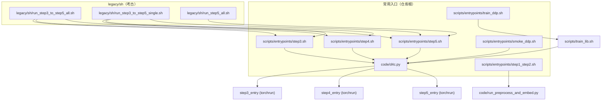

# D4C 脚本与运行期综合指南

## 文档更新说明

- **整合日期**：2026 年 3 月 28 日  
- **作用**：本文档为仓库内 **唯一维护** 的脚本速查、Shell/Python 分工、路径与 checkpoint/日志约定、`DDP_NPROC` 与 `D4C_NUM_PROC` 辨析、外置 YAML 预设与配置解析链、以及 `scripts/entrypoints/` 等编排脚本参数说明的综合参考。  
- **原则**：以 `scripts/**/*.sh`、`code/paths_config.py`、`code/d4c_core/path_layout.py`、`code/config.py` 源码为准；若叙述与代码不一致，以代码为准并应修正本文档。  
- **同步要求**：修改 `scripts/entrypoints/`、`scripts/orchestration/`、`scripts/lib/` 下 `*.sh` 或 `code/paths_config.py` / `path_layout.py` 时，须在同一提交内更新本文档。启用 `.githooks/pre-commit` 后，暂存上述文件时会校验是否一并暂存本文档。
- **补充文档**：根目录 **`README.md`**（快速上手）；**`docs/PRESETS.md`**（预设与合并顺序）；**`D4C_离线完整指南.md`**（离线环境、数据与集群）。日常命令与路径规范以**本文**为准；配置语义以 **PRESETS.md** 为准。

---

## 对外接口身份（请先读）

| 身份 | 路径 | 是否推荐给终端用户直接操作 |
|------|------|---------------------------|
| **MAINLINE ENTRY** | `code/d4c.py` | **是** — 唯一推荐 **Python** 入口；在仓库根执行 `python code/d4c.py …` |
| **Shell 编排** | `scripts/entrypoints/*.sh`、`scripts/orchestration/*.sh` | **按需** — 仅 GPU/CVD/DDP/nohup/循环；**应调用** `python code/d4c.py …`；由 `d4c_core.runners` 在子进程内 `torchrun` **`code/executors/step{3,4,5}_entry.py`** |
| **阶段 runner（torchrun 目标）** | `code/executors/step3_entry.py`、`step4_entry.py`、`step5_entry.py` | **否** — 仅供 `d4c_core.runners` / `torchrun` 加载；用户认知入口仍为 **`python code/d4c.py`**。排障：`D4C_DISPATCH_DETAIL=1` 打印实际入口脚本路径 |
| **LEGACY** | `legacy/*`（仓库根，另见 `legacy/README.md`） | 否 — 历史脚本，见 §4.8 |

---

## 1. 快速起步与速查（Quick Reference）

### 1.0 主入口优先级（新主线）

推荐按下列顺序选用入口（自上而下：越靠前越推荐作为「主路径」）：

| 优先级 | 入口 | 定位 |
|--------|------|------|
| **1** | `python code/d4c.py <子命令> …`（在项目根执行） | **MAINLINE ENTRY**：显式 `--task` / `--preset` / `--from-run` 等；子进程环境经 `d4c_core` 清洗；`torchrun` 加载 `executors/step{3,4,5}_entry.py`。 |
| **2** | `bash scripts/entrypoints/train_ddp.sh …` | **官方 Bash 批量入口**：GPU/DDP 校验后 **`python code/d4c.py`**（完整 3→4→5 时调用 **`d4c.py pipeline`**；实现见 `scripts/lib/train_lib.sh`）。 |
| **3** | `bash scripts/entrypoints/step{3,4,5}.sh …` | **单阶段 Shell 编排**：nohup/循环；**内部**只调 `d4c.py`，不承载训练业务默认。 |
| **4** | `bash scripts/entrypoints/smoke_ddp.sh` | **冒烟** = `python code/d4c.py smoke-ddp`。 |
| **5** | `scripts/multi_seed_paper_stats.py`、`scripts/check_presets.py` | 论文统计与预设检查等辅助工具。 |

**Legacy 批量串联**（`legacy/sh/run_step3_to_step5_*.sh`、`legacy/sh/run_step5_all.sh`）已迁出主线，见 **`docs/legacy_batch_shell.md`** 与 **`legacy/README.md`**。仓库根 **`legacy/code/`** 仅供考古，不保证可运行。

### 1.1 核心脚本一句话用途

| 路径 | 一句话用途 |
|------|------------|
| `scripts/entrypoints/step1_step2.sh` | Step 1+2：数据预处理 + 嵌入与域语义（非 DDP，调用 `code/run_preprocess_and_embed.py`） |
| `scripts/entrypoints/step3.sh` | Step 3：**Shell 编排** → `python code/d4c.py step3 …`；须传 `--iter vN`，可选 `--run-id`（默认 `auto` → `1`、`2`、…）；产物在 `runs/task{T}/vN/train/step3/<run>/` |
| `scripts/entrypoints/step4.sh` | Step 4：**Shell 编排** → `python code/d4c.py step4 … --eval-profile … --iter vN --from-run <run>` |
| `scripts/entrypoints/step5.sh` | Step 5：**Shell 编排** → `d4c.py step5` 或 `d4c.py eval`（`--eval-only` 时）；**须** `--task`、`--iter`、`--from-run`；训练 CSV 路径由 **Step5 目录名反推 Step4**（如 `2_1_1` → `train/step4/2_1/factuals_counterfactuals.csv`）；`--step5-run auto` 时须同时 `--step4-run`；`--eval-only` 须 `--step5-run` |
| `scripts/entrypoints/train_ddp.sh` | **官方 Bash 批量**：`source scripts/lib/train_lib.sh`，GPU/DDP 校验后 **`python code/d4c.py`**（`--pipeline 3,4,5` 且为 3→4→5 时等价 **`d4c.py pipeline`**） |
| `scripts/entrypoints/smoke_ddp.sh` | DDP 冒烟：`python code/d4c.py smoke-ddp`；产物在 `runs/task1/v0/train/step5/<run>/`（以启动打印为准） |
| `scripts/orchestration/task4_step5_nohup_monitored.sh` | Task4 Step5：**nohup 诊断包装**（启动/结束环境快照、`PYTHONFAULTHANDLER`、退出码写入 `*.exitcode`）；须 **`export STEP4_RUN=…`**；默认主日志 `runs/task4/v1/nohup_logs/task4_step5_alignment_first.nohup.log`；**勿**再套外层 `>log 2>&1`（由脚本 `exec` 写日志）；可选 `D4C_NOHUP_LOG` / `CONDA_SH` / `CONDA_ENV` |
| `code/d4c.py` | **MAINLINE ENTRY**：`step3` / `step4` / `step5` / `eval` / `pipeline` / `smoke-ddp`（见 `python code/d4c.py -h`） |

### 1.2 `d4c.py` 与 Shell 步骤脚本对照

| 步骤 | 推荐命令（首选） | Shell 编排等价入口 | 推荐场景 | 是否首推 | 须记住的概念 |
|------|------------------|-------------------|----------|----------|-------------|
| Step3 | `python code/d4c.py step3 --task N --preset step3 --iter vN …` | `bash scripts/entrypoints/step3.sh --task N --iter vN …` | 可复现实验、预设显式 | d4c.py **首推** | `iteration_id`（`vN`）/ `run_id`（默认 `1`、`2`、…） |
| Step4 | `python code/d4c.py step4 … --from-run <run> --eval-profile <stem>` | `bash scripts/entrypoints/step4.sh --from-run <run> --iter vN --task N --eval-profile <stem>` | 同上 | d4c.py **首推** | **`--eval-profile` 必填**；推理全局 batch 仅来自 `eval_profile.eval_batch_size`（strict 整除 `ddp_world_size`）；**不再**使用 training 的 `train_batch_size` |
| Step5 | `python code/d4c.py step5 … --eval-profile … --from-run …` | `bash scripts/entrypoints/step5.sh … --eval-profile …` | 同上 | d4c.py **首推** | 非 `--train-only` 须 `--eval-profile`；`step5-run` 为 `step4_n` slug；`auto` 时须 `--step4-run` |
| Eval | `python code/d4c.py eval … --eval-profile <stem>`（或 `--hardware-preset` + `--decode-preset`） | `bash scripts/entrypoints/step5.sh --eval-only …` | 已有权重仅评测 | d4c.py **首推**；评测定版 **`--eval-profile`** | 产物在 `runs/.../eval/<run>/`；rerank 用 `eval-rerank` |
| Pipeline | `python code/d4c.py pipeline … --eval-profile <stem>`（**必填**） | `bash scripts/entrypoints/train_ddp.sh --pipeline 3,4,5 …`（须传等价 `--eval-profile`） | 一键多步 | 交互式用 **d4c.py** | Step4 与 Step5（非 train-only）共用该 profile；每段自动分配新目录（默认不覆盖） |
| Smoke | `python code/d4c.py smoke-ddp` | `bash scripts/entrypoints/smoke_ddp.sh` | 环境/NCCL 是否可跑通 | d4c.py | — |

### 1.2.1 历史对照（附录级）：手写 `torchrun`

日常请忽略；完整旧命令与 env 约定见 **`docs/legacy_offline_torchrun.md`**。主线一律 **`python code/d4c.py …`**。

| 若必须在 `code/` 下手工 `torchrun`（须自行设置 `D4C_STAGE_RUN_DIR` 等，易错） | 推荐 |
|----------------------------------|----------------|
| `torchrun … executors/step3_entry.py train|eval …` | `python code/d4c.py step3 …` / `--eval-only` |
| `torchrun … executors/step4_entry.py …` | `python code/d4c.py step4 --from-run … --eval-profile <stem>` |
| `torchrun … executors/step5_entry.py train|eval …` | `python code/d4c.py step5` / `eval` |

**说明**：`d4c_core.runners` 集中构造 `torchrun` 与 `D4C_*` 子进程环境。确认实际加载的入口脚本：`export D4C_DISPATCH_DETAIL=1` 后再跑 `d4c.py`。

### 1.3 一键复制运行示例

```bash
# 项目根目录执行（以下路径均相对 D4C_ROOT）

# 新主线 CLI：迭代 vN + run 目录名（默认 auto → 1、2、…；Step4/5 链式见 d4c.py --help）
python code/d4c.py step3 --task 4 --preset step3 --iter v1
python code/d4c.py step4 --task 4 --preset step3 --iter v1 --from-run 1 --eval-profile eval_fast_single_gpu
python code/d4c.py step5 --task 4 --preset step5 --iter v1 --from-run 2 --step4-run 2_1 --step5-run auto --eval-profile eval_fast_single_gpu
python code/d4c.py eval --task 4 --preset step5 --iter v1 --from-run 2 --step5-run 2_1_1 --eval-profile eval_balanced_2gpu
python code/d4c.py eval-rerank --task 4 --preset step5 --iter v1 --from-run 2 --step5-run 2_1_1 --eval-profile eval_rerank_quality
python code/d4c.py pipeline --task 4 --preset step3 --iter v1 --eval-profile eval_fast_single_gpu
# 官方 eval profile 吞吐对比（顺序跑、写 CSV）：python scripts/bench_eval_profiles.py --task 4 --preset step5 --iter v1 --from-run 2 --step5-run 2_1_1

# Step 1+2（前台；后台加 --daemon）
bash scripts/entrypoints/step1_step2.sh
bash scripts/entrypoints/step1_step2.sh --embed-batch-size 512 --cuda-device 0

# Step 3 单任务 / 全任务（须带 --iter）
DDP_NPROC=1 bash scripts/entrypoints/step3.sh --task 4 --iter v1
# 双卡：可在 presets/hardware 中写 cuda_visible_devices，或仍用 shell 覆盖：
CUDA_VISIBLE_DEVICES=0,1 DDP_NPROC=2 bash scripts/entrypoints/step3.sh --task 2 --iter v1
bash scripts/entrypoints/step3.sh --all --from 4 --iter v1

# Step 4（--from-run 为 Step3 目录名）
bash scripts/entrypoints/step4.sh --from-run 1 --iter v1 --task 4 --eval-profile eval_fast_single_gpu
DDP_NPROC=1 bash scripts/entrypoints/step4.sh --from-run 1 --iter v1 --all --eval-profile eval_fast_single_gpu

# Step 5（须 --eval-profile，除非 --train-only）
DDP_NPROC=1 bash scripts/entrypoints/step5.sh --task 4 --iter v1 --from-run 2 --step4-run 2_1 --eval-profile eval_fast_single_gpu

# 官方 Bash 批量（须 --eval-profile；完整 3→4→5 等价于 d4c.py pipeline）
bash scripts/entrypoints/train_ddp.sh --pipeline 3,4,5 --task 4 --iter v1 --ddp-nproc 2 --gpus 0,1 --batch-size 1024 --eval-profile eval_fast_single_gpu

# Legacy 串联脚本（考古，见 docs/legacy_batch_shell.md）
# DDP_NPROC=1 bash legacy/sh/run_step3_to_step5_all.sh --iter v1

# DDP 冒烟（等价：bash scripts/entrypoints/smoke_ddp.sh）
python code/d4c.py smoke-ddp
```

### 1.3.1 运行清单（manifest）

- **stdout**：`d4c.py` 在 `step3` / `step4` / `step5` / `eval` / `eval-rerank` 下会打印 `[Stage]`、`[Preset]`（含 training/hardware/decode）、**step4 / eval*** 使用 **`--eval-profile`** 时另有 **`[Eval profile orchestrator]`** 与 **`step4_eval_inference`**（仅 step4）行、`[Semantic] training_semantic_fingerprint` / `generation_semantic_fingerprint`、`[Resolved Inputs]`、`[Resolved Outputs]`、`[Dispatch Summary]`、`[Manifest]` 提示行；`torchrun` 前另有 **`[startup_runtime_env]`**（`thread_*` / `launcher_*` 的 requested / effective JSON）。`pipeline` 每段各自打印；`smoke-ddp` 不生成标准 manifest。
- **JSON（默认开启）**：在每次 **`torchrun` 之前**，向 **当次 stage run 根目录下的 `manifest.json`** 写入一次（**schema 4.3**；与 `model/`、`logs/` 同级；`pipeline` 则每段各写一份）。**`runtime_env`** 为 **唯一**运行环境记录区（`thread_env_requested` / `thread_env_effective` / `launcher_env_requested` / `launcher_env_effective`）；**不再**在 `hyperparameters` 下镜像 OMP/MKL/TOKENIZERS。其余字段含 `manifest_schema_version`、`generated_at_utc`、`training_semantic_fingerprint`、`generation_semantic_fingerprint`、`cli_invocation`、结构化 `hyperparameters`（训练/并行语义）/ `paths` / `run_identifiers` 等。构建逻辑见 `code/d4c_core/manifests.py`。
- **关闭 JSON**：`export D4C_WRITE_RUN_MANIFEST=0`（或 `false` / `no` / `off`）。stdout 摘要仍保留。
- **预设对照**：manifest 中 `training_preset` / `hardware_preset` / `decode_preset` / `eval_profile`（编排名）、`consumed_presets`（`training_preset` / `hardware_preset` / `decode_preset` / `rerank_preset` / `eval_profile`）、`eval_profile_detail`（含 `orchestrator_yaml`）与 **docs/PRESETS.md** 一致。

### 1.3.2 高级调试与运维环境变量（非新手必会）

以下变量**不影响**「会不会用 d4c」；默认即可跑通。仅在排障、集群脚本或复现对照时使用。

| 变量 | 作用 | 备注 |
|------|------|------|
| `D4C_WRITE_RUN_MANIFEST` | `0/false/no/off` 时**不**写 `manifest.json` | 默认**写入** |
| `D4C_DISPATCH_DETAIL` | `1/true/yes/on` 时在 `[Dispatch][detail]` 打印 `torchrun` 入口脚本路径 | 纯排障 |
| `D4C_HARDWARE_PRESET` | 子进程内由 **runners 显式注入**（与 **`D4C_HARDWARE_PROFILE_JSON`** 同源）；日常请用 CLI **`--hardware-preset`**，勿依赖父 shell export |
| `D4C_HARDWARE_PROFILE_JSON` | 合并后的 hardware 切片（JSON）；**`build_resolved_training_config`** 在 torchrun 子进程内优先读此变量 | 由 d4c 写入，用户一般不手工设 |
| `D4C_RUN_D4C_EXTRA` | 追加到 torchrun 内 **step5_entry** argv（shlex 分割） | 高级；decode 请用顶层 `--decode-preset`；勿含未转义空格 |
| `D4C_MANIFEST_CLI_INVOCATION` | 由 `d4c.py` 在运行期设置，写入 manifest | **勿手工依赖** |

**子进程环境清洗（必读）**：`d4c_core.runners` 在 `torchrun` 前会删除父环境中的 `TRAIN_*`、`EVAL_BATCH_SIZE`、`MAX_PARALLEL_CPU` 以及**全部** `D4C_*`，再**显式注入**布局变量、**`D4C_HARDWARE_PROFILE_JSON` / `D4C_HARDWARE_PRESET`**、**`OMP_NUM_THREADS` / `MKL_NUM_THREADS` / `TOKENIZERS_PARALLELISM`**、按需 **`CUDA_VISIBLE_DEVICES`**（与 `load_resolved_config` 解析结果一致；**不写进** `D4C_HARDWARE_PROFILE_JSON`，亦**不参与** training/generation semantic fingerprint）、以及 decode/rerank JSON、`D4C_THREAD_ENV_*_JSON` / `D4C_LAUNCHER_ENV_*_JSON`（供子进程 `config_resolved.json` 回写 `runtime_env`）等。因此 **`export TRAIN_*` / `D4C_QUICK_EVAL_*` / 随意 `export D4C_HARDWARE_PRESET` 不会**作为稳定配置手段。

**Runtime / launcher env 优先级（每项独立）**：**CLI**（`--cuda-visible-devices`、`--omp-num-threads`、`--mkl-num-threads`、`--tokenizers-parallelism`）**>** 当前 shell 已 export **>** `presets/hardware/<stem>.yaml` **>** 内置默认。推荐：只传 **`--hardware-preset hw_2gpu_balanced`**（或经 `--eval-profile` 选中该 hardware），由 YAML 提供 `cuda_visible_devices` 与线程相关字段，nohup 脚本无需再手写 `export CUDA_VISIBLE_DEVICES` / `OMP_NUM_THREADS` 等。

**Eval 吞吐**：全局 valid eval batch 由 `presets/eval_profiles/*.yaml` 的 `eval_batch_size` 控制（见 manifest `global_eval_batch_size`）；**`--num-proc`** 主要影响 **HF tokenize cache** 并行度，**不等于** DataLoader `num_workers`（后者由 hardware 预设 YAML 的 **`dataloader_num_workers_valid`** 等决定）。耗时分解见 **`metrics.json` → `eval_performance.summary`** 与 **`eval_digest.log` → [Eval Timing Summary]**。

主流程推荐：**只使用 `python code/d4c.py …` + `--hardware-preset`（或 `--eval-profile`）**；可见 GPU 优先由 hardware preset 的 **`cuda_visible_devices`** 注入，必要时再用 shell 或 **`--cuda-visible-devices`** 覆盖。DDP 规模以 **`--ddp-world-size`** 与 hardware preset 的 **`ddp_world_size`** 为准（与 `DDP_NPROC` 映射见本文 §4）。Task4 最小命令可复制 **`scripts/templates/`** 下脚本。

### 1.3.3 `scripts/templates/`（Task4 最小链）

| 路径 | 用途 |
|------|------|
| `scripts/templates/task4_step3_min.sh` | Step3 |
| `scripts/templates/task4_step4_min.sh` | Step4 |
| `scripts/templates/task4_step5_min.sh` | Step5（`auto` 时须设 `STEP4_RUN`） |
| `scripts/templates/task4_eval_min.sh` | Eval |
| `scripts/templates/task4_eval_matrix_min.sh` | `eval-matrix` → `phase1_summary` |
| `scripts/templates/task4_eval_rerank_matrix_min.sh` | `eval-rerank-matrix` → `phase2_rerank_summary` |

### 1.4 脚本调用关系（Mermaid）



---

## 2. 核心架构与路径规范

### 2.1 `D4C_ROOT` 与数据布局

| 概念 | 解析方式 |
|------|----------|
| 项目根 | `get_d4c_root()`：环境变量 `D4C_ROOT`（若设置则取绝对路径），否则为 `code/` 的上一级目录 |
| 数据集 | `{D4C_ROOT}/data/<数据集名>/`（如 `reviews.pickle` 等） |
| 合并数据 | `{D4C_ROOT}/Merged_data/<task_idx>/` |
| 预训练权重 | `{D4C_ROOT}/pretrained_models/`（T5、MPNet 等） |

运行时读取 `D4C_ROOT`，不在 import 时冻结，避免子进程与 `export` 不一致。

### 2.2 正式产物根：`runs/` 与 `get_stage_run_dir`

**主线不再**向 `checkpoints/`、`log/` 写入训练/评测正式产物。`paths_config.get_stage_run_dir(task_idx)` 返回 **当前 torchrun 子进程内** 由 `d4c.py` 注入的 **`D4C_STAGE_RUN_DIR`**，即某次 **stage run 根目录**（勿与旧版仓库根下 `checkpoints/` 目录混淆），例如：

- Step3：`runs/task{T}/vN/train/step3/<run>/`
- Step4：`runs/task{T}/vN/train/step4/<step4-run>/`（读取 Step3 权重目录由子进程环境变量 **`D4C_STEP3_RUN_DIR`** 指向 `train/step3/<from-run>/`）
- Step5：`runs/task{T}/vN/train/step5/<run>/`
- Eval：`runs/task{T}/vN/eval/<run>/`

其下约定：**Step3：`model/model.pth`**；**Step5：`model/best_mainline.pth`（选模主真相）与训练收尾 `model/last.pth`（互不覆盖）**，配套 `*.meta.json`；**主日志**（Step3：**`logs/train.log`**（训练）+ 同目录 **`logs/eval.log`**（`d4c step3` 收尾 eval 或 `--eval-only`）；Step5：`logs/train.log`；Step4：**`train/step4/<step4-run>/logs/step4.log`**；独立 `eval`/`rerank` 子命令：`eval/<run>/logs/eval.log` 等）、**`manifest.json`**、**`config_resolved.json`** 等与当次 run 同目录。默认 `eval` / `post_train_eval` 加载 **`best_mainline.pth`**；仅当显式传入 **`--checkpoint-kind last`** 时使用 `last.pth`。

**相关环境变量**（由 `d4c_core.runners` 在子进程设置）：

| 变量 | 含义 |
|------|------|
| `D4C_STAGE_RUN_DIR` | 当前 stage run 根（= `get_stage_run_dir`） |
| `D4C_STEP3_RUN_DIR` | 仅 **step4**：Step3 权重所在 `train/step3/<from-run>/`（反事实 CSV / partial 仍写入 `D4C_STAGE_RUN_DIR`） |
| `D4C_EVAL_PROFILE_NAME` | **step4** / eval*：`--eval-profile` 的 stem |
| `D4C_GLOBAL_EVAL_BATCH_SIZE` / `D4C_EVAL_PER_GPU_BATCH_SIZE` | **仅 step4**：与 `manifest.hyperparameters` 中 `global_eval_batch_size` / `eval_per_gpu_batch_size` 一致 |
| `D4C_HF_CACHE_ROOT` | HF 缓存，通常为 `cache/task{T}/hf/` |
| `D4C_MANIFEST_DIR` | 与 stage run 根一致（写 `manifest.json`） |
| `D4C_EVAL_RUN_DIR` | 评测写出目录（eval / rerank run 根；旧名 `D4C_EVAL_ARTIFACT_DIR` 已废弃） |
| `D4C_ITERATION_META_DIR` | `runs/task{T}/vN/meta/`（`iteration.json`、`eval_registry.{txt,jsonl,csv}` 等） |
| `D4C_EVAL_SUMMARY_GLOBAL_DIR` | 可选；全局 eval 注册表目录（默认 `runs/global/vN/meta/`，文件名 `eval_registry_all.*`） |

**迭代与运行 ID**：CLI `--iter vN`（默认 `v1`）、`--run-id` / `auto` 时默认分配 **`1`、`2`、`3`、…**（同级仅扫描**纯数字**单段目录名取最大序号 +1；含下划线的 slug 与其它名称不参与递增）。显式参数须为 **slug**（如 `1`、`2_1`、`2_1_1`），不接受以 `run` 为前缀的旧式命名。详见 `code/d4c_core/run_naming.py`。**禁止**用 `%Y%m%d_%H%M%S` 作为目录主名。

#### 2.2.1 `runs/global/…/meta/` 与 `runs/task{T}/…/meta/` 边界（强制）

| 目录 | 允许 | **禁止**（必须落在 `runs/task{T}/vN/meta/` 或对应 stage run 目录） |
|------|------|-------------------------------------------------------------------|
| **`runs/global/vN/meta/`** | `eval_registry_all.*`；**多任务**编排器 `shell_logs`；其它** truly 跨任务**批处理摘要 | 单任务 eval / rerank 结果与注册、单任务 analysis pack、单任务 bad cases、**`multi_seed`**、单任务 shell 日志 |
| **`runs/task{T}/vN/meta/`** | `iteration.json`、`eval_registry.*`、单任务 `shell_logs`、`multi_seed/<run>/` | 把本应全局汇总的 `eval_registry_all.*` 挪到任务树（应由 Python 汇总逻辑写 global） |

辅助函数见 `code/d4c_core/path_layout.py`：`get_global_meta_dir`、`get_task_meta_dir`、`get_multiseed_root`。

### 2.3 评测与汇总、AI 分析包

| 子目录（均在 `runs/task{T}/vN/` 下） | 内容 |
|--------------------------------------|------|
| `eval/<run>/` | `metrics.json`、`predictions.*`、`eval_digest.log`、`manifest.json` |
| `rerank/<run>/` | rerank 候选、样例、指标等 |
| `matrix/<run>/` | `phase1_summary.*`、`phase2_rerank_summary.*`、`matrix_manifest.json` |
| `analysis/<pack>/` | `analysis-pack` 或评测结束自动导出的 **发给 AI 的打包材料** |
| `meta/`（任务内） | `iteration.json`、`eval_registry.{txt,jsonl,csv}`；单任务编排器：`meta/shell_logs/*.log`；**Step5 multi_seed**：`meta/multi_seed/<run>/train_seed_*.log` |
| `runs/global/vN/meta/` | **仅**跨任务：`eval_registry_all.{txt,jsonl,csv}`；**多任务** shell 汇总：`shell_logs/*.log` |
| `meta/multi_seed/<run>/` | `scripts/orchestration/step5_multi_seed.sh` 的按 seed shell tee；默认自动分配 `1`、`2`、…（`run_naming.next_run_id`）；显式 `--multi-seed-run 5` 或 `D4C_MULTI_SEED_RUN_ID=5` |

路径示例（可直接对照磁盘）：`runs/global/v1/meta/eval_registry_all.jsonl`；`runs/task4/v1/meta/eval_registry.jsonl`；`runs/task4/v1/meta/multi_seed/1/train_seed_3407.log`。

### 2.4 旧版 `log/`、`checkpoints/` 与 `logs/`（legacy）

| 路径 | 说明 |
|------|------|
| **`log/`、`checkpoints/`** | 旧布局；新版 **默认不写**。本地若仍存在仅作历史数据。 |
| **各 run 下 `logs/`**（复数） | 主线：`…/logs/train.log`（step3 训练 / step5）、**同目录 `eval.log`（仅 step3：收尾 eval / `--eval-only`）**、`…/logs/step4.log`（step4，位于 **`train/step4/<step4-run>/`**）、独立 eval run 下 `eval.log` 等。 |
| **`{D4C_ROOT}/logs/`** | 仅当未走 d4c 注入、且无有效 `log_file` 时的兜底；推荐始终通过 `python code/d4c.py` 启动。 |

### 2.5 其它路径与镜像日志

- **`code/log.out`**：`paths_config.DEFAULT_MIRROR_LOG`；环境变量 `D4C_MIRROR_LOG=1`（等）时部分写入可镜像至此文件。  
- **nohup / shell 汇总**：单任务 Step3/5 `--daemon` 时，nohup 输出写到对应 `<run>/logs/nohup.log`（与当阶段主日志同目录）。**Step4**：若 shell 传入 `--step4-run`，可与 `train/step4/<name>/logs/step4.log` 同目录；否则单任务 daemon 的 tee 常落在 `runs/task{T}/vN/meta/shell_logs/step4_*.log`（与 d4c 内真实 `step4.log` 可能不同路径，以 stdout / manifest 为准）。多任务编排器（如 Step3 `--all`、Step4 `--all` daemon、`legacy/sh/run_step5_all.sh`、`legacy/sh/run_step3_to_step5_*.sh`、`scripts/entrypoints/step1_step2.sh`）的终端汇总 tee 默认写入 `runs/global/vN/meta/shell_logs/*.log` 或 `runs/task{T}/vN/meta/shell_logs/*.log`（见 `scripts/lib/common_logs.sh`）。工作目录不当也可能在仓库根产生 `nohup.out`（见 `.gitignore`）。**Task4 手写 nohup**：可用 **`scripts/orchestration/task4_step5_nohup_monitored.sh`**（见 §1.1 表）在固定路径落主日志，并生成同前缀的 **`*.exitcode` / `*.finished_at` / `*.pid` / `*.meta.env`**，便于巡检脚本判断是否正常结束。

---

## 3. 运行期规范（Runtime & Execution）

### 3.1 Shell 层与 Python 层分工

| 层级 | 职责 |
|------|------|
| **Shell**（`scripts/entrypoints/*.sh` 等） | 设置 `D4C_ROOT`、可选 `D4C_HARDWARE_PRESET` / `D4C_ITER` 等；向 `d4c.py` 传入 **CLI**（含 `--preset` / `--eval-profile`）。**仅当**设置了 `DDP_NPROC` 或 `--ddp-nproc` 时才追加 `--ddp-world-size`；否则由 `presets/hardware/*.yaml`（eval* 下可由 **`--eval-profile`** selector 指向的 hardware preset）决定 DDP 规模。**注意**：torchrun 子进程会清洗未白名单环境变量；训练切片以父进程 `load_resolved_config` 为准，经 `D4C_EFFECTIVE_TRAINING_PAYLOAD_JSON` 下发。**主日志**：step3 为 `.../logs/train.log` + **`.../logs/eval.log`**；step5 为 `.../logs/train.log`；step4 为 **`train/step4/<step4-run>/logs/step4.log`**。已移除 `--gpus`。 |
| **Python**（`d4c_core.config_loader` + `config.build_resolved_training_config`） | 父进程在 `load_resolved_config` 合并 presets 并写入 manifest；子进程 `build_resolved_training_config` **仅消费** `D4C_EFFECTIVE_TRAINING_PAYLOAD_JSON` 与 `D4C_HARDWARE_PROFILE_JSON`，不再用 `D4C_TRAIN_PRESET` 二次推断。 |

### 3.2 `DDP_NPROC` 与 `D4C_NUM_PROC`（严格区分）

| 名称 | 作用域 | 含义 |
|------|--------|------|
| **`DDP_NPROC`** | Shell + `torchrun` | 与 `torchrun --nproc_per_node` 一致；主线 `scripts/entrypoints/step{3,4,5}.sh` **不设默认**：未 export 时不向 `d4c.py` 传 `--ddp-world-size`，由 **merge 后的 hardware preset**（eval* 若用 `--eval-profile`，其 selector 解析出的 hardware）的 `ddp_world_size` 决定。`=1` 仍为单进程 DDP。Python 侧以 `WORLD_SIZE` 为准。 |
| **`D4C_NUM_PROC`** | Python（datasets.map 等 CPU 并行） | Hugging Face `datasets` 的 `map` **进程数**；与 DataLoader `num_workers` 独立。 |

### 3.3 训练配置解析链（父进程 + 子进程）

1. **父进程**（`code/d4c_core/config_loader.py` 的 `load_resolved_config`）：eval* 若提供 `--eval-profile`，**先** `resolve_eval_profile`（编排层，非 YAML 平铺层）；再按命令合并 **task → training → hardware → decode（若消费）→ rerank（eval-rerank*）**；生成 **`D4C_EFFECTIVE_TRAINING_PAYLOAD_JSON`**、**`D4C_TRAINING_SEMANTIC_FINGERPRINT`** / **`D4C_GENERATION_SEMANTIC_FINGERPRINT`**（有则）并注入子进程。
2. **子进程**（`code/config.py` 的 `build_resolved_training_config`）：**必须**存在 `D4C_EFFECTIVE_TRAINING_PAYLOAD_JSON`；用其中的 `training_row` 与 `TASK_DEFAULTS` 构造 `FinalTrainingConfig`；**不再**根据 `D4C_TRAIN_PRESET` / `TRAINING_PRESETS` / 训练侧 ENV 重算切片。`num_proc`、DataLoader 等仍以 **`D4C_HARDWARE_PROFILE_JSON`**（父进程写入）为主，子进程在已注入 JSON 时不再用 `MAX_PARALLEL_CPU` / `D4C_NUM_PROC` 等 ENV 覆盖。

Shell 辅助函数 `get_train_batch_size()` / `get_epochs()` 仍可供**无 d4c CLI** 的场景读取 YAML/ENV，但与 torchrun 子进程内的 `FinalTrainingConfig` **解耦**。

#### Full BLEU 调度（`full_bleu_eval`）

- **唯一真相源**：`presets/training/<preset>.yaml` 中每个任务行的 **`full_bleu_eval`**，经父进程写入 **`D4C_EFFECTIVE_TRAINING_PAYLOAD_JSON`**，子进程 **`build_resolved_training_config`** 仅从此读取。
- **支持值**：**`mode: off`**（不做全验证集 BLEU；`dual_bleu_eval` 不启用）或 **`mode: interval`** 且必填 **`every_epochs`**（正整数；epoch 从 1 计数，满足 `epoch % every_epochs == 0` 时跑 full BLEU）。
- **已删除（勿再用）**：曾用于改 full BLEU 间隔的 **环境变量**、**训练子进程 CLI 开关**，以及 **training 行里的旧标量 / 分阶段字段**；现仅允许上文的 **`full_bleu_eval`** 块（详见 **`docs/PRESETS.md`** §1.2）。
- **可观测**：**`manifest.json`** → **`hyperparameters.full_bleu_eval_resolved`**；Step3/Step5 run 根目录 **`config_resolved.json`** 含同结构；**`[startup_config_check]`** 与 **`train.log`** 含 **`[full_bleu_eval]`** 行。

### 3.4 Runtime 预设与 CPU 侧并发

- **环境变量**：`D4C_HARDWARE_PRESET=<键名>` 由 **runners 注入**（与 hardware 预设 stem 一致）；命名表来自内置 `HARDWARE_PRESETS` 或 `presets/hardware/*.yaml`（需 PyYAML；失败则回退内置）。**主线请勿依赖父 shell 单独 export 选预设**。
- **`max_parallel_cpu`**（`build_resolved_training_config` 内）：**hardware_base → hardware_preset → `MAX_PARALLEL_CPU`（ENV）**（已注入 `D4C_HARDWARE_PROFILE_JSON` 时仅信 JSON）
- **`num_proc`（datasets.map）**：**derived(min(cpu, max_parallel)) → hardware_preset → `D4C_NUM_PROC` → CLI `num_proc`**
- **DataLoader `num_workers`（按 split）**：自动推导 → hardware_preset → `D4C_DATALOADER_WORKERS_*`（ENV）→ 可选 CLI（见 `_resolve_dataloader_num_workers_for_split`）

训练预设与运行预设 **独立**：训练侧由 **`python code/d4c.py --preset <stem>`**（或 `presets/training/<stem>.yaml`）选定；**不再**通过 `D4C_TRAIN_PRESET` 环境变量二次选型。`D4C_HARDWARE_PRESET` 对应 CPU/DataLoader 并发（辅路径；主线推荐 hardware YAML + eval_profile 编排）。

### 3.5 外置 YAML 与任务表

| 目录 | 作用 |
|------|------|
| `presets/tasks/*.yaml` | 若成功加载且恰好包含任务 1..8，则替代内置 `TASK_DEFAULTS`；否则回退内置并告警 |
| `presets/training/*.yaml` | 合并/覆盖命名训练预设（由 CLI `--preset` 选择 stem） |
| `presets/hardware/*.yaml` | 合并/覆盖 `HARDWARE_PRESETS`（与 `D4C_HARDWARE_PRESET` 联用） |

未安装 PyYAML 时跳过对应 YAML，使用内置字典。

### 3.6 `training_hardware_inputs.py`

`collect_training_hardware_overrides_from_args(args)` 从训练 CLI 命名空间收集非 `None` 字段，**不写回 `os.environ`**，供 `build_resolved_training_config` 使用（**不含** full BLEU 调度；该项仅来自 training preset / payload）。

---

## 4. 脚本参数详解（按流水线顺序）

下列表格中「必填」「默认」以脚本 `usage` 与参数解析为准；**互斥**：`--eval-only` 与 `--train-only` 不能同时使用（Step 3 / Step 5 支持二者）。Step 5 在 **step5 runner** 内使用子命令 **`train` / `eval` / `test` / `generate_samples`**（须 `torchrun`，由 `d4c.py` 编排）；`scripts/entrypoints/step5.sh` 在 `--eval-only` 时调用 `d4c eval`，否则调用 `d4c step5`。`train` 下 **`--train-only`** 表示训练结束后跳过收尾评测。

### 4.1 Step 1+2：`scripts/entrypoints/step1_step2.sh`

| 参数 | 必填 | 说明 |
|------|------|------|
| `--embed-batch-size N` | 否 | 转发至 `run_preprocess_and_embed.py` |
| `--cuda-device N` | 否 | 嵌入阶段单卡设备 |
| `--daemon` / `--bg` | 否 | 后台：shell 汇总 `runs/global/vN/meta/shell_logs/step1_step2_<时间戳>.log` |

### 4.2 Step 3：`scripts/entrypoints/step3.sh`

| 参数 | 必填 | 默认 / 回退 |
|------|------|-------------|
| `--task N` 或 `--all` | 二选一 | 无则打印用法并退出 |
| `--iter vN` | 否 | 默认 `v1`（或 `export D4C_ITER`） |
| `--run-id <name>` / `auto` | 否 | 默认由 `d4c.py` 自动分配下一数字目录名（`1`、`2`、…） |
| `--eval-only` | 否 | 仅 step3 runner 的 eval |
| `--train-only` | 否 | 仅 train，跳过训练后 eval |
| `--from N` | 否 | 仅 `--all`：从任务 N 开始 |
| `--skip a,b,...` | 否 | 跳过列出任务 |
| `--batch-size` / `--epochs` / `--num-proc` | 否 | 显式传入时 **最后覆盖** 对应 preset；日常可改 `presets/training/*.yaml` / `presets/hardware/*.yaml` |
| `--ddp-nproc K` | 否 | 等同 `DDP_NPROC`；**不设默认**，省略时由 presets/hardware 决定 `ddp_world_size` |
| `--daemon` / `--bg` | 否 | 单任务：`--eval-only` 时 Python 写 `.../logs/eval.log`，否则 `.../logs/train.log`（完整 run 训练后另有同目录 `eval.log`）；同目录 `nohup.log`。`--all`：终端汇总 `runs/global/vN/meta/shell_logs/step3_optimized_*_daemon_*.log`；前台 `--all` tee 默认 `runs/global/vN/meta/shell_logs/step3_optimized_all_*.log`（可用 `D4C_STEP3_ALL_SHELL_LOG` 覆盖） |

产物根：`runs/task{T}/vN/train/step3/<run>/`（不再写 `checkpoints/` / `log/` 树下的优化子目录）。

### 4.3 Step 4：`scripts/entrypoints/step4.sh`

| 参数 | 必填 | 默认 / 回退 |
|------|------|-------------|
| `--from-run NAME` | **是** | 与 `runs/.../train/step3/<run>/` 一致（同 `d4c.py step4`） |
| `--eval-profile STEM` | 否 | 省略时使用环境变量 `D4C_STEP4_EVAL_PROFILE`，再回退 `D4C_EVAL_PROFILE`，再默认 `eval_fast_single_gpu`；**始终**转发给 `d4c.py step4`（主线合同：`d4c.py step4` 侧 **必填** `--eval-profile`） |
| `--step4-run NAME` | 否 | 省略时由 `d4c.py` 在 `train/step4/` 下按 `{from-run}_n` 自动分配；显式则使用该目录名 |
| `--iter vN` | 否 | 默认 `v1` |
| `--task N` 或 `--all` | 二选一 | — |
| `--from` / `--skip` | 否 | 同 Step 3，仅 `--all` |
| `--num-proc` | 否 | 显式传入才转发 `d4c.py`；**不再**向 `d4c.py step4` 转发 `--batch-size`（推理 batch 仅由 `eval_profile.eval_batch_size` 决定） |
| `--ddp-nproc` | 否 | 不设默认；省略时不传 `--ddp-world-size` |
| `--daemon` / `--bg` | 否 | 单任务：若传了 `--step4-run`，主日志可在 `train/step4/<name>/logs/step4.log`；否则常见为 `meta/shell_logs/step4_*.log`；`--all` daemon：汇总 `runs/global/vN/meta/shell_logs/step4_optimized_daemon_*.log` |

### 4.4 Step 5：`scripts/entrypoints/step5.sh`

| 参数 | 必填 | 默认 / 回退 |
|------|------|-------------|
| `--task N` | **是**（1–8） | — |
| `--iter vN` | 否 | 默认 `v1` |
| `--from-run NAME` | **是** | Step 3 的 run 目录名（同 `d4c.py`） |
| `--step4-run NAME` | 条件 | **仅当训练且** `--step5-run auto` 时**必填**（用于拼 `train/step4/<name>/` 做前置检查）；显式 `--step5-run`（如 `2_1_1`）时 CSV 路径**仅**由 step5 目录名去掉末段反推 `train/step4/2_1/`，**不再**读取本参数 |
| `--step5-run <name>` | 条件 | 训练可省略→`auto`（须同时 `--step4-run`）；显式时须至少两段 slug；**`--eval-only` 必须**指定已有 Step5 目录名（不可为 `auto`） |
| `--eval-only` / `--train-only` | 否 | 互斥；`--eval-only` → `d4c eval` |
| `--seed N` | 否 | 转发 `d4c step5` / `d4c eval` |
| `--batch-size` / `--epochs` / `--num-proc` / `--ddp-nproc` | 否 | 显式传入才转发；与预设冲突时报错；脚本不再自动注入默认 batch/epochs |
| `D4C_RUN_D4C_EXTRA` | 否 | 追加到 torchrun 内 step5 runner argv |
| `--daemon` / `--bg` | 否 | Python 日志 + 同目录 `nohup.log` |

**已取消** `--all`。Step5 权重路径：`runs/.../train/step5/<run>/model/best_mainline.pth` 与 `.../model/last.pth`。

前置检查：Step 3 目录存在；**训练**时要求 `train/step4/<反推名>/factuals_counterfactuals.csv` 存在（显式 `--step5-run` 时反推名恒为去掉最后一层 `_` 段，如 `2_1_1`→`2_1`；`auto` 时**仅**用 `--step4-run` 拼路径）；`d4c.py` 会在 Step5 run 目录创建指向该 CSV 的软链。**`--eval-only`** 不检查 CSV。

### 4.5 串联与批量脚本

**官方主线**：多步与批量请用 **`bash scripts/entrypoints/train_ddp.sh`**（`--pipeline 3,4,5` 等），见 §4.6。

**Legacy**（不保证长期同步）：`legacy/sh/run_step5_all.sh`、`legacy/sh/run_step3_to_step5_all.sh`、`legacy/sh/run_step3_to_step5_single.sh` — 参数与行为说明见 **`docs/legacy_batch_shell.md`**（现调用 `scripts/entrypoints/*.sh`）。

**`scripts/orchestration/step5_multi_seed.sh`**  
串行多 seed 调 `scripts/entrypoints/step5.sh`。未设置 `D4C_MULTI_SEED_LOGROOT` 时**须在参数中提供** `--task N`，默认 shell tee 根目录为 `runs/task{N}/vN/meta/multi_seed/<run>/`（`run_naming.next_run_id`；**非时间戳**）。可选 `--multi-seed-run 5`。论文统计优先读各 `train/step5/<run>/logs/train.log`，亦可指向 `meta/multi_seed/<run>/train_seed_*.log`。

### 4.6 `scripts/entrypoints/train_ddp.sh`（`train_lib.sh`）

| 参数 | 说明 |
|------|------|
| `--step 3|4|5` 与 `--pipeline 3,4,5` | **二选一**；pipeline 去重后排序执行（完整 `3,4,5` 等价 `d4c.py pipeline`；其它组合仅为分步 Shell orchestrator，顺序调用 `d4c.py step{3,4,5}`） |
| `--task N` | 必填 |
| `--iter vN` | 迭代目录，默认 `v1`（或环境变量 `D4C_ITER`） |
| `--from-run NAME` | 无 Step 3 的 pipeline（如 4,5）或单步 4/5 时必填；含 Step 3 时可省略（Step 4/5 用本轮最新 `train/step3/` 子目录，`sort -V`） |
| `--gpus LIST` | 仅设置 `CUDA_VISIBLE_DEVICES` |
| `--ddp-nproc K` | 设置并透传 `DDP_NPROC` → `--ddp-world-size`；未传则不追加该参数。**batch-size 须能被 K 整除**（若二者均指定） |
| `--preset` | `scripts/entrypoints/train_ddp.sh` 转发为 `d4c.py --preset`（**不**再使用 `--train-preset` / `D4C_TRAIN_PRESET`） |
| `--batch-size N` | 透传；参与整除校验 |

### 4.8 `legacy/`（仓库根，考古）

索引见 **`legacy/README.md`**。主线代码路径 **`legacy/code/`**（历史 `run_all.sh`、`train.py`、`naive_*`、`do_stats.py`、`check_eval_metrics_env.py`）；**`legacy/sh/`** 为迁出的旧批量串联脚本；**`legacy/tools/fix_eval_csv_header.py`** 修补旧 CSV 表头。日常训练与复现请使用 §1.0 中的入口。

### 4.9 `code/tools/`（运维 / 排障）

| 路径 | 用途 |
|------|------|
| `code/tools/check_train_log.py` | 轻量检查 `train.log` |
| `code/tools/compare_step4_csvs.py` | Step4 CSV 比对 |

在项目根执行：`python code/tools/<脚本>.py …`。迁仓前 CSV 表头修补见 §4.8 `legacy/tools/fix_eval_csv_header.py`。

---

## 5. 参考与自检

- 修改脚本后对照：各文件头 `usage`、`case`/解析循环、`export` 语句。  
- 路径对照：`paths_config.get_stage_run_dir` 与本文第 2 节。  
- 集群：Slurm/tmux 包装若存在，须与本文 **同一参数语义**（`--iter`、`--from-run`、`--step5-run`、`--eval-profile`）；仓库内无固定 `tmux-slurm/` 模板时以本指南与 `scripts/entrypoints/*.sh` 为准自行编写。  
- **离线数据与依赖**：根目录 **`D4C_离线完整指南.md`** 为补充说明（环境、数据准备、集群细节）；**脚本主入口与参数以本文 §1 为准**，勿以离线指南替代本文。直连 `torchrun` / `legacy/run_all.sh` 的考古命令见 **`docs/legacy_offline_torchrun.md`**。
