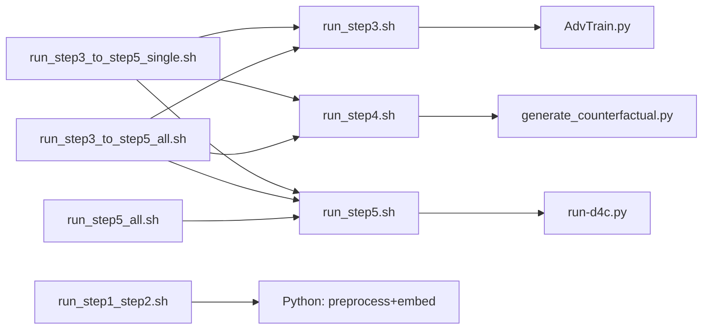

# D4C：`sh/` 脚本用法速查

本文档依据 `sh/` 目录下各 `.sh` 源码与 `[脚本参数说明 copy 2.md](脚本参数说明%20copy%202.md)` 整理；**参数与行为以脚本源码为准**。若与 `脚本参数说明 copy 2.md` 冲突，以本文对源码的说明为准。

**工作目录约定（通用）**：所有脚本均通过 `BASH_SOURCE` 解析 `D4C_ROOT`（项目根目录），再 `cd` 到 `code/`。因此可从**任意当前工作目录**调用，只要传入脚本的**路径正确**即可。推荐在**项目根目录**执行：`bash sh/<脚本名>.sh ...`。若在 `sh/` 目录内，也可：`bash ./<脚本名>.sh ...`（等价）。

---

## `checkpoints/` 与 `log/` 路径（全局）

根目录均在 **项目根** `<D4C_ROOT>` 下：权重与反事实在 `**checkpoints/`**，运行日志在 `**log/**`。`<D4C_ROOT>` 默认为 `code/` 的上一级；可用环境变量 `**D4C_ROOT**` 指向其它克隆位置（须与数据、`pretrained_models` 等相对关系一致）。

**单任务目录**由 `code/paths_config.py` 的 `get_checkpoint_task_dir(task)` 与 `get_log_task_dir(task)` 决定（`task` 为 `1`–`8`）。**注意**：当 **`D4C_CHECKPOINT_GROUP` 与 `D4C_CHECKPOINT_SUBDIR` 均非空** 时，权重在 `checkpoints/<task>/<GROUP>/<SUBDIR>/`，而**主日志目录固定在 `log/<task>/<GROUP>/`**（**不再**按 SUBDIR 分层；eval 汇总在同级 `eval/`），与 checkpoint 路径**不完全对称**。

**仅影响日志、与 checkpoint 解耦**：若 **`D4C_LOG_GROUP`** 或 **`D4C_LOG_SUBDIR`** 任一非空，则 **`get_log_task_dir`** 只按这两变量解析（语义与 **`D4C_CHECKPOINT_GROUP` / `D4C_CHECKPOINT_SUBDIR`** 对称；双非空时目录为 **`log/<task>/<D4C_LOG_GROUP>/`**）。否则若 **`D4C_LOG_STEP`** 非空，则为 **`log/<task>/<D4C_LOG_STEP>/`**。以上均未命中时才用 **`D4C_CHECKPOINT_*`** 的旧规则。**`run_step4.sh`** 默认 **`export D4C_LOG_STEP=step4`**（仅当变量**未设置**时；若需 Step 4 主日志跟 checkpoint 同表，可 **`export D4C_LOG_STEP=`** 设为空字符串）。


| `D4C_CHECKPOINT_GROUP` | `D4C_CHECKPOINT_SUBDIR` | `checkpoints/<task>/…` | `log/<task>/…`（Step 3/5 主日志根；其下 **`runs/…/train.log`**） |
| ---------------------- | ----------------------- | ---------------------- | -------------------------------------- |
| 空                      | 空                       | `checkpoints/<task>/` | `log/<task>/` |
| 空                      | 非空                      | `checkpoints/<task>/<SUBDIR>/` | `log/<task>/<SUBDIR>/` |
| 非空                     | 空                       | `checkpoints/<task>/<GROUP>/` | `log/<task>/<GROUP>/` |
| 非空                     | 非空                      | `checkpoints/<task>/<GROUP>/<SUBDIR>/` | **`log/<task>/<GROUP>/`**（不按 SUBDIR 再分子目录） |


**典型文件**：训练权重 `**model.pth`**；Step 4 生成的反事实表 `**factuals_counterfactuals.csv**`，均在上述「单任务 checkpoint 目录」内（由 `AdvTrain.py` / `run-d4c.py` / `generate_counterfactual.py` 写入）。

**各脚本的默认环境变量（未手动 export 时）**

- `**run_step3.sh`**：未手动设置 `D4C_CHECKPOINT_SUBDIR` 时自动 `GROUP=step3`、`SUBDIR=step3_<时间戳>`，权重例如 `checkpoints/2/step3/step3_20250320_1430/model.pth`；**Python 主日志**（`AdvTrain.py --log_file`）为 **`log/<task>/…/runs/<YYYYMMDDHHMMSS>/train.log`**（`get_log_task_dir` 见上表；默认 GROUP+SUBDIR 时 `…` 为 **`step3`**）。`**D4C_LOG_USE_TIMESTAMP=0**` 时为 **`…/runs/run/train.log`**（固定覆盖）。前台**不对** `train.log` 再 `tee`。任务行 **`aux/target/lr/coef/adv`** 来自 **`code/config.py`**（**`export D4C_TRAIN_PRESET`** 可覆盖各任务 **`adv`** 及部分训练默认，见 **`TRAINING_PRESETS`**）。
- `**run_step3_optimized.sh`**：不修改 `run_step3.sh` 默认；在子进程中 **`export D4C_TRAIN_MODE=optimized`** 等后 **`exec bash run_step3.sh`**。默认 **`D4C_CHECKPOINT_GROUP=step3_optimized`**、**`D4C_CHECKPOINT_SUBDIR=step3_opt_<时间>`**、**`D4C_LOG_GROUP=step3_optimized`**；未传 **`--batch-size`** 时追加 **`--batch-size`**，值为 **`config.get_train_batch_size()`**（模块默认 **2048**；命名预设可改为如 **1024**），可用 **`D4C_OPT_BATCH_SIZE`** 再覆盖。
- `**run_step5.sh`**：**仅嵌套模式**：必填 **`--task N`** 与 **`--step3-subdir`**，权重在 **`checkpoints/<task>/step3/<NAME>/step5/step5_<时间>/`**（checkpoint **`GROUP=step3`**）。主日志默认 **`log/<task>/step5/runs/…/train.log`**（脚本在未设置 **`D4C_LOG_GROUP` / `D4C_LOG_SUBDIR` / `D4C_LOG_STEP`** 时 **`export D4C_LOG_GROUP=step5`**，**对每个 task∈1–8** 均为 **`log/<N>/step5/…`**，与 **`log/<N>/step3/`** 分离）。已**取消**独立 **`checkpoints/<task>/step5/step5_*`**；**批量 1–8** 请用 **`run_step5_all.sh`**。`**--eval-only**` 须同时 **`--nested-subdir <已有内层名>`**。
- `**run_step5_optimized.sh`**：与 **`run_step5.sh`** 参数相同，但 **`--step3-subdir`** 须对应 **`checkpoints/<task>/step3_optimized/<目录>/`**（通常来自 **`run_step3_optimized.sh`**）；物理路径 **`…/step3_optimized/…/step5/step5_opt_<时间>/`**；**`D4C_CHECKPOINT_GROUP=step3_optimized`**；主日志默认 **`log/<task>/step5_optimized/`**。
- `**run_step4_optimized.sh`**：在 **`run_step4.sh`** 前设置 **`GROUP=step3_optimized`**、**`SUBDIR=<--step3-subdir>`**（**必填**，与 **`run_step3_optimized`** 同一目录名）；**`D4C_LOG_STEP=step4_optimized`**（若未预先设置 **`D4C_LOG_GROUP` / `D4C_LOG_SUBDIR`** ）。未传 **`--batch-size`** 时默认 **`config.get_train_batch_size()`**（**`D4C_OPT_BATCH_SIZE`** 可覆盖）。
- `**run_step5_all.sh`**：依次对选定任务跑 Step 5；每任务自动解析 **`checkpoints/<task>/step3/`** 下最新 **`step3_*`**，**`--eval-only`** 时再解析 **`…/step5/`** 下最新 **`step5_*`**；支持 **`--from`** / **`--skip`**；**`--daemon`** 时终端汇总 **`log/step5_all_*.log`**（每任务 **`train.log`** 仍在 **`log/<task>/step5/runs/…`**）。

`**log/` 的两种用法**

1. **Step 3 / Step 5 / Step 4 结构化主日志**（`--log_file`）：位于 **`get_log_task_dir(task)/runs/<秒级时间戳>/train.log**`；`**export D4C_LOG_USE_TIMESTAMP=0**` 时为 **`…/runs/run/train.log`**。Step 3 / 5 由 **`AdvTrain.py` / `run-d4c.py`** 写入；Step 4 由 **`generate_counterfactual.py`** 经 **`PerfMonitor`** 写入（**不对**该 `train.log` 再 **`tee`**）。eval 汇总等由 Python 写到同级 **`eval/`**（见 `paths_config` 文档字符串）。**后台单任务**（`--daemon` / `--bg`）：`nohup` 的 stdout/stderr 写入与 `train.log` **同目录**的 **`nohup.log`**；子进程默认 **`D4C_CONSOLE_LEVEL=WARNING`**，避免与 `FileHandler` 重复刷 INFO（可用环境变量覆盖）。
2. **扁平汇总文件**（均在 `**log/`** 根下，不按 task 分子目录）：例如 `step1_step2_*.log`、`step3_daemon_*.log`、`step3_eval_daemon_*.log`、`**step4_daemon_*.log**`、`**step5_all_*.log**`、`step3_to_5_all_*.log`、`step3_to_5_taskN_*.log` 等；用于 Step 1+2、串联脚本整段 `tee`，**`run_step5_all.sh --daemon`** 的整段 `tee`，或 Step 3 / 4 在 `**--all --daemon**` 时的终端汇总（Step 3 在 `**--eval-only**` 时为 `**step3_eval_daemon_*.log**`）。**`run_step5.sh`** 仅单任务，`**--daemon**` 时无全任务汇总文件名（每任务日志仍在 **`log/<task>/step5/runs/…`**）。

**可选**：设置 `**D4C_MIRROR_LOG=1`** 时，部分 Python 结构化日志可额外镜像到 `**code/log.out**`（见 `paths_config.append_log_dual`）；与主 `train.log` 路径相同时不会重复写入。

---

## 范围一览（每个文件一行）


| 文件名                            | 用途                                                   |
| ------------------------------ | ---------------------------------------------------- |
| `run_step1_step2.sh`           | Step 1+2：数据预处理与嵌入、域语义（`run_preprocess_and_embed.py`） |
| `run_step3.sh`                 | Step 3：域对抗预训练与评估（`torchrun` + `AdvTrain.py`，DDP）     |
| `run_step3_optimized.sh`       | Step 3 **工程优化入口**：在调用 `run_step3.sh` 前设置 `D4C_TRAIN_MODE=optimized`、大 batch 默认、`warmup_cosine`、quick/full eval 与早停等；checkpoint 默认 **`GROUP=step3_optimized`**、`SUBDIR=step3_opt_<时间>`；日志默认 **`log/<task>/step3_optimized/`** |
| `run_step4.sh`                 | Step 4：生成反事实（`torchrun` DDP + `generate_counterfactual.py`，与 Step 3/5 对齐） |
| `run_step4_optimized.sh`       | Step 4 **工程优化入口**：**必填 `--step3-subdir`**（与 **`step3_optimized`** 下目录名一致）、**`GROUP=step3_optimized`**；主日志默认 **`log/<task>/step4_optimized/`** |
| `run_step5.sh`                 | Step 5：仅嵌套 checkpoint（**`--task` + `--step3-subdir`**，`torchrun` + `run-d4c.py`，DDP） |
| `run_step5_optimized.sh`       | Step 5 **工程优化入口**：物理目录 **`checkpoints/<task>/step3_optimized/<step3_opt_id>/`**；默认内层 **`step5_opt_<时间>`**；**`D4C_CHECKPOINT_GROUP=step3_optimized`**；主日志默认 **`log/<task>/step5_optimized/`**；`run-d4c.py` 带 `--train-mode optimized` 与 eval/早停/warmup 默认参数 |
| `run_step5_all.sh`             | Step 5 批量任务 1–8：每任务自动 **`step3_*`**（**`--eval-only`** 时再 **`step5_*`**），内部多次调 **`run_step5.sh`** |
| `run_step3_to_step5_single.sh` | 单任务串联：Step 3 → 4 → 5（内部调用上述三个脚本）                     |
| `run_step3_to_step5_all.sh`    | 任务 1–8 批量串联：每任务 Step 3 → 4 → 5（内部调用上述三个脚本）           |


---

## `run_step1_step2.sh`

**说明摘录（文件头）**：Step 1 + Step 2 合并；数据预处理 + 嵌入与域语义。用法：`bash run_step1_step2.sh [--embed-batch-size N] [--daemon|--bg]`。`--daemon` / `--bg`：后台运行，日志写入 `log/step1_step2_*.log`。

**必填 / 可选**


| 类型  | 参数                                                      |
| --- | ------------------------------------------------------- |
| 必填  | 无（可零参数运行）                                               |
| 可选  | `--embed-batch-size N`、`--daemon` / `--bg` |


与 `[脚本参数说明 copy 2.md](脚本参数说明%20copy%202.md)` 中「run_step1_step2」一致。

**调用关系**：不调用其它 `sh/` 脚本；直接执行 `code/run_preprocess_and_embed.py`。

**一键复制运行**（假定当前目录为项目根 `D4C-main`）

```bash
bash sh/run_step1_step2.sh
```

```bash
bash sh/run_step1_step2.sh --embed-batch-size 512
```

```bash
bash sh/run_step1_step2.sh --daemon
```

---

## `run_step3.sh`

**说明摘录（文件头）**：Step 3 域对抗预训练（优先 `torchrun`，若无则回退 `python -m torch.distributed.run` + DDP）。主日志与 Step 5 对齐：默认 **`get_log_task_dir(task)/runs/<YYYYMMDDHHMMSS>/train.log`**（`**D4C_LOG_USE_TIMESTAMP=0**` 时为 **`…/runs/run/train.log`**），由 `AdvTrain.py --log_file` 写入。`**--daemon**`：单任务时上述 `train.log` + 同目录 **`nohup.log`**；`**--all --daemon**` 时另有 `log/step3_daemon_*.log` 或 `step3_eval_daemon_*.log`。要点：`--task N` 与 `--all` 二选一；`**--eval-only**` 与 `**--train-only**` **互斥**；`--from` / `--skip` 仅配合 `--all`；`--ddp-nproc` 或环境变量 `DDP_NPROC`（默认 2）；多卡请 **`CUDA_VISIBLE_DEVICES`**。NLTK：`D4C_ROOT/pretrained_models/nltk_data`。

**必填 / 可选**


| 类型  | 参数                                                                                                                                                |
| --- | ------------------------------------------------------------------------------------------------------------------------------------------------- |
| 必填  | `--all` **或** `--task N`（N 为 1–8）                                                                                                                 |
| 可选  | `--eval-only`、`--train-only`（与前者互斥）、`--from N`（仅 `--all`）、`--skip N,M,...`、`--batch-size`、`--epochs`、`--num-proc`、`--ddp-nproc K`、`--daemon` / `--bg` |


与 `[脚本参数说明 copy 2.md](脚本参数说明%20copy%202.md)` 中「run_step3」一致。

未传 `--batch-size` / `--epochs` 时由 `code/config.py` 决定（当前模块默认训练 batch **2048**、epochs **50**；**`D4C_TRAIN_PRESET`** 可覆盖，以源码为准）。

**调用关系**：不调用其它 `sh/` 脚本。

**一键复制运行**

```bash
bash sh/run_step3.sh --task 1
```

```bash
DDP_NPROC=1 bash sh/run_step3.sh --task 2
```

```bash
CUDA_VISIBLE_DEVICES=0,1 DDP_NPROC=2 bash sh/run_step3.sh --task 2 --batch-size 1024
```

```bash
bash sh/run_step3.sh --all --from 4
```

```bash
bash sh/run_step3.sh --task 5 --eval-only
```

```bash
bash sh/run_step3.sh --task 4 --train-only
```

```bash
bash sh/run_step3.sh --all --daemon
```

---

## `run_step3_optimized.sh`

**说明**：不修改 `run_step3.sh` 源码；在 **`exec`** 前 **`export`** `D4C_TRAIN_MODE=optimized`、`warmup_cosine`、quick/full BLEU 与早停相关环境变量；默认 checkpoint **`GROUP=step3_optimized`**、**`SUBDIR=step3_opt_<时间>`**；主日志根默认 **`log/<task>/step3_optimized/`**。未传 **`--batch-size`** 时：若当前 **`D4C_TRAIN_PRESET`** 为**按任务**预设（**`TRAINING_PRESETS`** 顶层键为 **1..8**），**不**统一注入 batch，由 **`AdvTrain`** 按任务取 **`get_train_batch_size(task)`**；否则追加 **`config.get_train_batch_size()`**（**`D4C_OPT_BATCH_SIZE`** 仍可覆盖）。一键示例：**`export D4C_TRAIN_PRESET=gb1024_ep30_fe2`**（**`config.py`** 中为 **8** 个任务各一条，默认同值；可逐任务改 **`train_batch_size` / `epochs` / `adv`** 等）。

**参数**：与 **`run_step3.sh`** 完全相同（`--task` / `--all` / `--eval-only` / `--daemon` 等）。

```bash
bash sh/run_step3_optimized.sh --task 4
```

```bash
CUDA_VISIBLE_DEVICES=0,1 DDP_NPROC=2 bash sh/run_step3_optimized.sh --task 2 --batch-size 1024
```

```bash
# 固定每 3 epoch 一次 full BLEU（不设则 Python 默认：前 10 epoch 每 5 轮、之后每 2 轮）
D4C_FULL_EVAL_EVERY=3 TRAIN_EARLY_STOP_PATIENCE_FULL=5 bash sh/run_step3_optimized.sh --task 1 --daemon

D4C_TRAIN_PRESET=gb1024_ep30_fe2 CUDA_VISIBLE_DEVICES=0,1 DDP_NPROC=2 bash sh/run_step3_optimized.sh --task 4
```

---

## `run_step4.sh`

**说明摘录（文件头）**：Step 4 生成反事实；需先有 Step 3 的 **`model.pth`**。权重路径由 **`get_checkpoint_task_dir(task)`** 决定（见上文路径表）：默认 **`checkpoints/<task>/model.pth`**；若 Step 3 曾用子目录保存，跑 Step 4 前须 **`export D4C_CHECKPOINT_GROUP`** / **`D4C_CHECKPOINT_SUBDIR`** 与当时训练**完全一致**（Step 4 **无** `--eval-only`，全程仅为加载权重并生成反事实）。**主日志**与 checkpoint **解耦**：默认 **`D4C_LOG_STEP=step4`**（见上文「仅影响日志」），即 **`log/<task>/step4/runs/<时间戳>/train.log`**；**`--all --daemon`** 时另有终端汇总 **`log/step4_daemon_*.log`**。默认 **`torchrun --standalone --nproc_per_node=$DDP_NPROC`** 调 `generate_counterfactual.py`（与 `run_step3.sh` / `run_step5.sh` 同套路；无 `torchrun` 时回退 **`python -m torch.distributed.run`**）。**`DDP_NPROC`** 或 **`--ddp-nproc K`**（默认 2）须与可见 GPU 数一致；全局 **`--batch-size` 须能被进程数整除**；多卡请 **`CUDA_VISIBLE_DEVICES`**。单卡：**`DDP_NPROC=1`**。不推荐：`cd code && python generate_counterfactual.py …`（单进程路径，与 shell 默认 torchrun 不同）。

**必填 / 可选**


| 类型  | 参数                                                                                                  |
| --- | --------------------------------------------------------------------------------------------------- |
| 必填  | `--all` **或** `--task N`（1–8）                                                                       |
| 可选  | `--from N`（仅 `--all`）、`--skip N,M,...`、`--batch-size`、`--num-proc`、`--ddp-nproc K`、`--daemon` / `--bg` |


与 `[脚本参数说明 copy 2.md](脚本参数说明%20copy%202.md)` 中「run_step4」一致。

**调用关系**：不调用其它 `sh/` 脚本；在 `code/` 下执行 **`generate_counterfactual.py`**（经 torchrun）。

**一键复制运行**

```bash
bash sh/run_step4.sh --task 2
```

```bash
bash sh/run_step4.sh --all --from 4
```

```bash
bash sh/run_step4.sh --all --skip 2,5
```

```bash
CUDA_VISIBLE_DEVICES=0,1 DDP_NPROC=2 bash sh/run_step4.sh --task 2 --batch-size 1024
```

```bash
DDP_NPROC=1 bash sh/run_step4.sh --task 2 --batch-size 64
```

```bash
bash sh/run_step4.sh --all --daemon
```

```bash
# 指定 Step 3 权重目录：须与当时 Step 3 训练保存的 GROUP/SUBDIR 一致（仅用 checkpoints/<task>/model.pth 时可不设 export）
export D4C_CHECKPOINT_GROUP=step3
export D4C_CHECKPOINT_SUBDIR=step3_20260323_1123
CUDA_VISIBLE_DEVICES=0,1 DDP_NPROC=2 bash sh/run_step4.sh --task 4 --daemon
```

---

## `run_step4_optimized.sh`

**用途**：在 **`run_step3_optimized.sh`** 产出的 **`checkpoints/<task>/step3_optimized/<step3_opt_id>/model.pth`** 上跑 Step 4；**必填 `--step3-subdir`**（与上述 `<step3_opt_id>` 一致）。主日志默认 **`log/<task>/step4_optimized/runs/…/train.log`**。其余参数与 **`run_step4.sh`** 相同。

```bash
bash sh/run_step4_optimized.sh --task 2 --step3-subdir step3_opt_20260324_1400
```

```bash
CUDA_VISIBLE_DEVICES=0,1 DDP_NPROC=2 bash sh/run_step4_optimized.sh --all --step3-subdir step3_opt_20260324_1400
```

---

## `run_step5.sh`

**说明摘录（文件头）**：Step 5 **仅**支持嵌套 checkpoint（**无** `checkpoints/<task>/step5/step5_*`，**无** `--all`）。优先 `torchrun` + `run-d4c.py`；`DDP_NPROC` / `--ddp-nproc`（默认 2）。`**export HF_EVALUATE_OFFLINE=1**`（可被覆盖）。主日志默认 **`log/<task>/step5/runs/<时间戳>/train.log`**（**`D4C_LOG_GROUP=step5`**，与 checkpoint 的 **`GROUP=step3`** 解耦）。`**--daemon**`：同目录 **`nohup.log`**。`**--eval-only**`：须 **`--nested-subdir`**；`**--train-only**` 与前者互斥。

**目录**：**`checkpoints/<task>/step3/<NAME>/step5/step5_<分钟时间戳>/`**（训练时内层默认按时间；可用 **`--nested-subdir`** 指定）；csv 软链 **`../../factuals_counterfactuals.csv`**；**`D4C_CHECKPOINT_SUBDIR=<NAME>/step5/<内层>`**。

**`run_step3_to_step5_single.sh` / `run_step3_to_step5_all.sh`**：在 Step 5 前自动选取 **`checkpoints/<task>/step3/`** 下**最新修改**的 **`step3_*`** 作为 **`--step3-subdir`**；若 **`--eval-only`**，再自动选取 **`…/step5/`** 下最新的 **`step5_*`** 作为 **`--nested-subdir`**。

**必填 / 可选**


| 类型  | 参数                                                                                                                              |
| --- | ------------------------------------------------------------------------------------------------------------------------------- |
| 必填  | `--task N`（1–8）、**`--step3-subdir NAME`**（与 `checkpoints/<N>/step3/<NAME>/` 一致） |
| 可选  | `--eval-only`、`--train-only`（互斥）、`--nested-subdir 内层名`（训练默认 `**step5_<时间>**`；**`--eval-only` 必填**）、`--batch-size`、`--epochs`、`--num-proc`、`--ddp-nproc K`、`--daemon` / `--bg` |


与 `[脚本参数说明 copy 2.md](脚本参数说明%20copy%202.md)` 中「run_step5」一致。

未传 `--batch-size` / `--epochs` 时默认同 `config.py`（当前训练 batch **2048**、epochs **50**；**`--eval-only`** 时不注入默认 `--epochs`）。

**调用关系**：不调用其它 `sh/` 脚本。

**一键复制运行**

```bash
bash sh/run_step5.sh --task 2 --step3-subdir step3_20260323_1123
```

```bash
DDP_NPROC=1 bash sh/run_step5.sh --task 2 --step3-subdir step3_20260323_1123
```

```bash
CUDA_VISIBLE_DEVICES=0,1 DDP_NPROC=2 bash sh/run_step5.sh --task 2 --step3-subdir step3_20260323_1123 --batch-size 1024
```

```bash
bash sh/run_step5.sh --task 2 --step3-subdir step3_20260323_1123 --batch-size 64 --epochs 30
```

```bash
bash sh/run_step5.sh --task 2 --step3-subdir step3_20260323_1123 --daemon
```

```bash
bash sh/run_step5.sh --task 2 --step3-subdir step3_20260323_1123 --train-only
```

```bash
# 仅评估：须指定已有内层目录（…/step3/<NAME>/step5/<内层>/model.pth）
CUDA_VISIBLE_DEVICES=0,1 DDP_NPROC=2 bash sh/run_step5.sh --task 3 --step3-subdir step3_20260323_1123 \
  --nested-subdir step5_20260328_1123 --eval-only --daemon
```

```bash
# 指定内层名再训练（否则默认新建 step5_<当前分钟时间戳>）
bash sh/run_step5.sh --task 4 --step3-subdir step3_20260323_1123 \
  --nested-subdir step5_20260328_1123 --batch-size 1024
```

---

## `run_step5_optimized.sh`

**说明**：独立脚本（非 `run_step5.sh` 包装）；物理目录 **`checkpoints/<task>/step3_optimized/<step3_opt_id>/`**；**`--step3-subdir`** 须与该目录名一致；默认内层 **`step5_opt_<时间>`**；**`D4C_CHECKPOINT_GROUP=step3_optimized`**；主日志默认 **`log/<task>/step5_optimized/`**；**`torchrun run-d4c.py`** 带 **`--train-mode optimized`** 及 eval/早停/warmup 等 CLI。未传 **`--batch-size`** 且非 **`--eval-only`** 时默认 **`config.get_train_batch_size()`**（**`D4C_OPT_BATCH_SIZE`** 可覆盖）。

**参数**：与 **`run_step5.sh`** 相同（必填 **`--task`** + **`--step3-subdir`**；**`--eval-only`** 须 **`--nested-subdir`**）。

```bash
bash sh/run_step5_optimized.sh --task 2 --step3-subdir step3_opt_20260324_1400
```

```bash
CUDA_VISIBLE_DEVICES=0,1 DDP_NPROC=2 bash sh/run_step5_optimized.sh --task 4 --step3-subdir step3_opt_20260324_1400 --daemon
```

```bash
bash sh/run_step5_optimized.sh --task 3 --step3-subdir step3_opt_20260324_1400 \
  --nested-subdir step5_opt_20260328_1123 --eval-only
```

---

## `run_step5_all.sh`

**用途**：在**已完成各任务 Step 3/4** 的前提下，对 **task 1–8**（可用 **`--from`** / **`--skip`** 缩小）**依次**执行 **`run_step5.sh`**；每任务自动传入该任务下最新的 **`--step3-subdir`**，**`--eval-only`** 时再传最新的 **`--nested-subdir`**。

**必填 / 可选**


| 类型  | 参数 |
| --- | --- |
| 可选  | **`--from N`**、**`--skip N,M,…`**、**`--eval-only`** / **`--train-only`**（互斥）、**`--batch-size`**、**`--epochs`**、**`--num-proc`**、**`--ddp-nproc K`**、**`--daemon`** / **`--bg`** |

**调用关系**：仅调用 **`run_step5.sh`**（不跑 Step 3/4）。

```bash
CUDA_VISIBLE_DEVICES=0,1 DDP_NPROC=2 bash sh/run_step5_all.sh --batch-size 1024
```

```bash
bash sh/run_step5_all.sh --from 3 --skip 2,7
```

```bash
bash sh/run_step5_all.sh --eval-only
```

```bash
bash sh/run_step5_all.sh --daemon
```

---

## `run_step3_to_step5_single.sh`

**说明摘录（文件头）**：单任务顺序执行 Step 3 → 4 → 5。`--from 3|4|5` 可从指定步续跑；`**--eval-only`** 时 **Step 3** 与 **Step 5** 均只 eval（内部传子脚本的 `--eval-only`），**Step 4** 仍会执行；`**--train-only**` 时 Step 3 / Step 5 跳过训练后的收尾 eval（与 `--eval-only` 互斥）。Step 5 前自动解析 **`checkpoints/<task>/step3/`** 下最新 **`step3_*`**；**`--eval-only`** 时再解析 **`…/step5/`** 下最新 **`step5_*`**。**Step 3 / Step 4 / Step 5** 均为 **`torchrun` DDP**；多卡请 **`CUDA_VISIBLE_DEVICES`** 与 **`DDP_NPROC` / `--ddp-nproc`**（见 `run_step3_to_step5_single.sh` 文件头）。

**必填 / 可选**


| 类型  | 参数                                                                                                                       |
| --- | ------------------------------------------------------------------------------------------------------------------------ |
| 必填  | `--task N`（1–8）                                                                                                          |
| 可选  | `--from 3|4|5`（默认从 3 开始）、`--eval-only`、`--train-only`（互斥）、`--batch-size`、`--epochs`、`--num-proc`、`--ddp-nproc`、`--daemon` / `--bg` |


与 `[脚本参数说明 copy 2.md](脚本参数说明%20copy%202.md)` 中「run_step3_to_step5_single」一致。

**调用关系**：依次调用 `run_step3.sh`、`run_step4.sh`、`run_step5.sh`（**不要**再单独跑同任务的这三个脚本，除非刻意分段重跑）。

**一键复制运行**

```bash
bash sh/run_step3_to_step5_single.sh --task 2
```

```bash
DDP_NPROC=1 bash sh/run_step3_to_step5_single.sh --task 2
```

```bash
CUDA_VISIBLE_DEVICES=0,1 DDP_NPROC=2 bash sh/run_step3_to_step5_single.sh --task 2 --batch-size 1024
```

```bash
bash sh/run_step3_to_step5_single.sh --task 2 --from 4
```

```bash
bash sh/run_step3_to_step5_single.sh --task 2 --daemon
```

```bash
# 串联下仅 eval Step 3 与 Step 5（Step 4 仍跑）；Step 5 自动选最新 step5_* 内层目录
bash sh/run_step3_to_step5_single.sh --task 2 --eval-only
```

---

## `run_step3_to_step5_all.sh`

**说明摘录（文件头）**：对任务 1–8（可由 `--from` / `--skip` 缩小）每个任务执行 Step 3 → 4 → 5。`**--eval-only`** 时每个任务的 **Step 3** 与 **Step 5** 均只 eval（子脚本均带 `--eval-only`），**Step 4** 不变；`**--train-only**` 时 Step 3 / Step 5 均带 `--train-only`（互斥于 `--eval-only`）。批量 Step 5 仅 eval 前请 `**export D4C_CHECKPOINT_SUBDIR=…`**（及按需 `**D4C_CHECKPOINT_GROUP**`）指向与各任务一致的已有训练子目录。**Step 3 / Step 4 / Step 5** 均为 DDP；多卡请 **`CUDA_VISIBLE_DEVICES`** + **`DDP_NPROC` / `--ddp-nproc`**（与各 `run_step*.sh` 一致）。

**必填 / 可选**


| 类型  | 参数                                                                                                                          |
| --- | --------------------------------------------------------------------------------------------------------------------------- |
| 必填  | 无单独模式开关；默认覆盖任务 1–8（受 `--from` / `--skip` 约束）                                                                                |
| 可选  | `--from N`、`--skip N,M,...`、`--eval-only`、`--train-only`（互斥）、`--batch-size`、`--epochs`、`--num-proc`、`--ddp-nproc`、`--daemon` / `--bg` |


与 `[脚本参数说明 copy 2.md](脚本参数说明%20copy%202.md)` 中「run_step3_to_step5_all」一致。

**注意**：源码中 `*) shift ;;` 会**静默丢弃**未知参数（见同目录 `脚本参数说明 copy 2.md` 第一节）。

**调用关系**：循环内调用 `run_step3.sh`、`run_step4.sh`、`run_step5.sh`（**不要**与单任务串联脚本对同一任务重复全套执行）。

**一键复制运行**

```bash
bash sh/run_step3_to_step5_all.sh
```

```bash
DDP_NPROC=1 bash sh/run_step3_to_step5_all.sh
```

```bash
CUDA_VISIBLE_DEVICES=0,1 DDP_NPROC=2 bash sh/run_step3_to_step5_all.sh --ddp-nproc 2 --batch-size 1024
```

```bash
bash sh/run_step3_to_step5_all.sh --from 4 --skip 2,5
```

```bash
bash sh/run_step3_to_step5_all.sh --daemon
```

```bash
# 每任务 Step 3 + Step 5 仅 eval（Step 4 仍跑）；各任务自动选最新 step5_* 内层目录
bash sh/run_step3_to_step5_all.sh --eval-only
```

---

## 总览表


| 脚本名                            | 一句话用途              | 最常用的一条命令（单行）                                    |
| ------------------------------ | ------------------ | ----------------------------------------------- |
| `run_step1_step2.sh`           | 预处理 + 嵌入与域语义       | `bash sh/run_step1_step2.sh`                    |
| `run_step3.sh`                 | 域对抗预训练 / eval（DDP） | `bash sh/run_step3.sh --task 1`                 |
| `run_step3_optimized.sh`       | Step 3 工程优化（大 batch / eval 默认等） | `bash sh/run_step3_optimized.sh --task 1`       |
| `run_step4.sh`                 | 生成反事实              | `bash sh/run_step4.sh --task 1`                 |
| `run_step4_optimized.sh`       | Step 4 工程优化（须 `--step3-subdir` 对齐 step3_optimized） | `bash sh/run_step4_optimized.sh --task 1 --step3-subdir step3_opt_…` |
| `run_step5.sh`                 | Step 5 仅嵌套（须 `--step3-subdir`） | `bash sh/run_step5.sh --task 1 --step3-subdir step3_…` |
| `run_step5_optimized.sh`       | Step 5 工程优化嵌套（`step3_optimized`） | `bash sh/run_step5_optimized.sh --task 1 --step3-subdir step3_opt_…` |
| `run_step5_all.sh`             | Step 5 批量 1–8（仅 Step 5） | `bash sh/run_step5_all.sh`                      |
| `run_step3_to_step5_single.sh` | 单任务 Step 3→4→5     | `bash sh/run_step3_to_step5_single.sh --task 1` |
| `run_step3_to_step5_all.sh`    | 全任务 Step 3→4→5     | `bash sh/run_step3_to_step5_all.sh`             |


---

## 脚本调用关系简图




独立跑流水线时：先用 `run_step1_step2.sh`，再按需使用 Step 3/4/5 或串联脚本。

**工程优化流水线（与论文复现隔离）**：依次使用 **`run_step3_optimized.sh`** → **`run_step4_optimized.sh`**（**必填 `--step3-subdir`**，与 Step3 的 `step3_opt_*` 目录名一致）→ **`run_step5_optimized.sh`**（**`--step3-subdir`** 同上）。**`run_step3_to_step5_single.sh` / `run_step3_to_step5_all.sh` / `run_step5_all.sh`** 内部仍调用 **`run_step3.sh` / `run_step4.sh` / `run_step5.sh`**，**不会**自动走 optimized 目录；若要用 optimized 产物，请手动按上式分段执行或自行封装。

---

## 其它入口（可选，不在 `sh/` 内）

| 路径 | 说明 |
|------|------|
| `code/run_all.sh` | 离线一键顺序跑 Step 1–5（在 `code/` 下直接 `torchrun`，**不**经过 `sh/run_step*.sh` 的路径与 checkpoint 环境变量逻辑） |
| `run_remaining_tasks.sh`（项目根） | 后台顺序跑 Task 2–8，日志 `log/remaining_tasks_*.log`；参数 `--skip-prep`、`--from N`（2–8）（详见脚本内注释与调用链） |