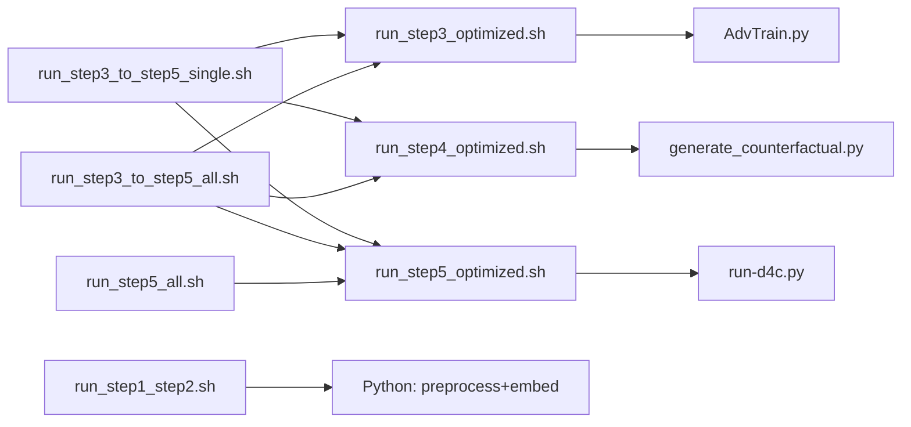

# D4C：`sh/` 脚本用法速查

**统一入口**：**`scripts/train_ddp.sh`**（**`scripts/train_lib.sh`**）：**`--step 3|4|5`** 或 **`--pipeline 3,4,5`**（如 **`3,4,5`**、**`4,5`**），详见 **`bash scripts/train_ddp.sh --help`** 与 **`docs/D4C_RUNTIME_SPEC.md`**。现有 **`sh/run_step*_optimized.sh`** 仍可直接使用。

本文档依据 `sh/` 目录下各 `.sh` 源码与 `[脚本参数说明 copy 3.md](脚本参数说明%20copy%203.md)` 整理；**参数与行为以脚本源码为准**。若与 `脚本参数说明 copy 3.md` 冲突，以本文对源码的说明为准。

**工作目录约定（通用）**：所有脚本均通过 `BASH_SOURCE` 解析 `D4C_ROOT`（项目根目录），再 `cd` 到 `code/`。因此可从**任意当前工作目录**调用，只要传入脚本的**路径正确**即可。推荐在**项目根目录**执行：`bash sh/<脚本名>.sh ...`。若在 `sh/` 目录内，也可：`bash ./<脚本名>.sh ...`（等价）。

---

## `checkpoints/` 与 `log/` 路径（全局）

根目录均在 **项目根** `<D4C_ROOT>` 下：权重与反事实在 `**checkpoints/`**，运行日志在 `**log/**`。`<D4C_ROOT>` 默认为 `code/` 的上一级；可用环境变量 `**D4C_ROOT**` 指向其它克隆位置（须与数据、`pretrained_models` 等相对关系一致）。Python 的 `paths_config` 通过 `get_d4c_root()` 等在**运行时**解析根目录与 checkpoint 子路径，避免仅因提前 `import` 而固定旧环境。

**单任务目录**由 `code/paths_config.py` 的 `get_checkpoint_task_dir(task)` 与 `get_log_task_dir(task)` 决定（`task` 为 `1`–`8`）。**注意**：当 **`D4C_CHECKPOINT_GROUP` 与 `D4C_CHECKPOINT_SUBDIR` 均非空** 时，权重在 `checkpoints/<task>/<GROUP>/<SUBDIR>/`，而**主日志目录固定在 `log/<task>/<GROUP>/`**（**不再**按 SUBDIR 分层；eval 汇总在同级 `eval/`），与 checkpoint 路径**不完全对称**。

**仅影响日志、与 checkpoint 解耦**：若 **`D4C_LOG_GROUP`** 或 **`D4C_LOG_SUBDIR`** 任一非空，则 **`get_log_task_dir`** 只按这两变量解析（语义与 **`D4C_CHECKPOINT_GROUP` / `D4C_CHECKPOINT_SUBDIR`** 对称；双非空时目录为 **`log/<task>/<D4C_LOG_GROUP>/`**）。否则若 **`D4C_LOG_STEP`** 非空，则为 **`log/<task>/<D4C_LOG_STEP>/`**。以上均未命中时才用 **`D4C_CHECKPOINT_*`** 的旧规则。**`run_step4_optimized.sh`** 在未设 **`D4C_LOG_GROUP` / `D4C_LOG_SUBDIR`** 时默认 **`D4C_LOG_STEP=step4_optimized`**（`${D4C_LOG_STEP-step4_optimized}`，与「变量未设置」语义一致；若需主日志跟 checkpoint 同表可 **`export D4C_LOG_STEP=`** 设为空字符串）。


| `D4C_CHECKPOINT_GROUP` | `D4C_CHECKPOINT_SUBDIR` | `checkpoints/<task>/…` | `log/<task>/…`（Step 3/5 主日志根；其下 **`runs/…/train.log`**） |
| ---------------------- | ----------------------- | ---------------------- | -------------------------------------- |
| 空                      | 空                       | `checkpoints/<task>/` | `log/<task>/` |
| 空                      | 非空                      | `checkpoints/<task>/<SUBDIR>/` | `log/<task>/<SUBDIR>/` |
| 非空                     | 空                       | `checkpoints/<task>/<GROUP>/` | `log/<task>/<GROUP>/` |
| 非空                     | 非空                      | `checkpoints/<task>/<GROUP>/<SUBDIR>/` | **`log/<task>/<GROUP>/`**（不按 SUBDIR 再分子目录） |


**典型文件**：训练权重 `**model.pth`**；Step 4 生成的反事实表 `**factuals_counterfactuals.csv**`，均在上述「单任务 checkpoint 目录」内（由 `AdvTrain.py` / `run-d4c.py` / `generate_counterfactual.py` 写入）。

**各脚本的默认环境变量（未手动 export 时）**

- `**run_step3_optimized.sh`**（Step 3 **唯一**入口）：默认 **`GROUP=step3_optimized`**、**`SUBDIR=step3_opt_<时间戳>`**，权重例如 **`checkpoints/2/step3_optimized/step3_opt_20250320_1430/model.pth`**；主日志 **`log/<task>/step3_optimized/…/runs/<时间戳>/train.log`**。脚本内 **`export`** 与 **`config` / AdvTrain** 一致的 LR、BLEU 采样、早停等默认值；**`aux/target/lr/coef/adv`** 由 **`get_task_params`** 读 **`TASK_DEFAULTS`**（仅任务表，不含预设合并）。Python 侧 batch 等由 **`build_resolved_training_config`** 统一解析。未传 **`--batch-size`** 时按 **`D4C_OPT_BATCH_SIZE` / 预设 / BASE** 等规则注入（见脚本与 **`config.py`**）。**可选**：**`D4C_RUNTIME_PRESET`**（如 **`gpu01_single_12c`** / **`gpu01_ddp2_12c`**）在 **`config.RUNTIME_PRESETS`** 中统一 **`num_proc` / DataLoader workers / prefetch**；与 **`D4C_TRAIN_PRESET`** 独立；仍可用 **`MAX_PARALLEL_CPU`**、**`D4C_NUM_PROC`** 等覆盖（详见 **`config.py`** 与 **`run_step3_optimized.sh`** 文件头注释）。
- `**run_step4_optimized.sh`**：**必填 `--step3-subdir`**（与 Step 3 目录名一致）；**`GROUP=step3_optimized`**；主日志默认 **`step4_optimized`**；未传 **`--batch-size`** 时逻辑同 Step 3（**`D4C_OPT_BATCH_SIZE`** 等）。
- `**run_step5_optimized.sh`**：**`--task`** + **`--step3-subdir`**；嵌套 **`step3_optimized/…/step5/step5_opt_<时间>/`**；**`GROUP=step3_optimized`**；主日志默认 **`step5_optimized`**；**`run-d4c.py`** 带 **`--min-epochs`** 等与 Step 3 对齐的 CLI。**`--eval-only`** 须 **`--nested-subdir`**。
- `**run_step5_all.sh`**：每任务自动选 **`checkpoints/<task>/step3_optimized/`** 下最新 **`step3_opt_*`**；**`--eval-only`** 时再选最新 **`step5_opt_*`**；内部调用 **`run_step5_optimized.sh`**。

`**log/` 的两种用法**

1. **Step 3 / Step 5 / Step 4 结构化主日志**（`--log_file`）：位于 **`get_log_task_dir(task)/runs/<秒级时间戳>/train.log**`；`**export D4C_LOG_USE_TIMESTAMP=0**` 时为 **`…/runs/run/train.log`**。Step 3 / 5 由 **`AdvTrain.py` / `run-d4c.py`** 写入；Step 4 由 **`generate_counterfactual.py`** 经 **`PerfMonitor`** 写入（**不对**该 `train.log` 再 **`tee`**）。eval 汇总等由 Python 写到同级 **`eval/`**（见 `paths_config` 文档字符串）。**后台单任务**（`--daemon` / `--bg`）：`nohup` 的 stdout/stderr 写入与 `train.log` **同目录**的 **`nohup.log`**；子进程默认 **`D4C_CONSOLE_LEVEL=WARNING`**，避免与 `FileHandler` 重复刷 INFO（可用环境变量覆盖）。
2. **扁平汇总文件**（均在 `**log/`** 根下）：例如 `step1_step2_*.log`、`step3_optimized_daemon_*.log`、`step3_optimized_eval_daemon_*.log`、`step4_optimized_daemon_*.log`、`step5_all_*.log`、`step3_to_5_all_*.log`、`step3_to_5_taskN_*.log` 等。**`run_step5_optimized.sh --daemon`** 无全任务汇总名（每任务 **`log/<task>/step5_optimized/runs/…`**）。

**可选**：设置 `**D4C_MIRROR_LOG=1`** 时，部分 Python 结构化日志可额外镜像到 `**code/log.out**`（见 `paths_config.append_log_dual`）；与主 `train.log` 路径相同时不会重复写入。

---

## 范围一览（每个文件一行）


| 文件名                            | 用途                                                   |
| ------------------------------ | ---------------------------------------------------- |
| `run_step1_step2.sh`           | Step 1+2：数据预处理与嵌入、域语义（`run_preprocess_and_embed.py`） |
| `smoke_test_ddp.sh`            | **DDP 链路自检**（`nproc_per_node=1` 仍为 DDP）：极小 Step3 train/eval + Step4 + Step5 各跑一段，验证不 crash；**不评指标**；产物在 `checkpoints/1/smoke_ddp/` |
| `run_step3_optimized.sh`       | Step 3 正式入口：域对抗预训练与评估（`torchrun` + `AdvTrain.py`）；**`step3_optimized` / `step3_opt_*`**；默认训练 env 与 **`config`** 对齐 |
| `run_step4_optimized.sh`       | Step 4 正式入口：**必填 `--step3-subdir`**；**`step4_optimized`** 主日志；`generate_counterfactual.py` DDP |
| `run_step5_optimized.sh`       | Step 5 正式入口：嵌套 **`step5_opt_*`**；**`run-d4c.py`** + 与 Step 3 一致的 eval/早停/warmup CLI |
| `run_step5_all.sh`             | Step 5 批量 1–8：自动最新 **`step3_opt_*`** / **`step5_opt_*`**，内部调 **`run_step5_optimized.sh`** |
| `run_step3_to_step5_single.sh` | 单任务串联：Step 3 → 4 → 5（内部调用上述三个脚本）                     |
| `run_step3_to_step5_all.sh`    | 任务 1–8 批量串联：每任务 Step 3 → 4 → 5（内部调用上述三个脚本）           |


---

## `run_step1_step2.sh`

**说明摘录（文件头）**：Step 1 + Step 2 合并；数据预处理 + 嵌入与域语义。用法：`bash run_step1_step2.sh [--embed-batch-size N] [--cuda-device N] [--daemon|--bg]`。嵌入阶段为**单进程单 GPU**（`compute_embeddings.py --cuda-device`）。`--daemon` / `--bg`：后台运行，日志写入 `log/step1_step2_*.log`。

**必填 / 可选**


| 类型  | 参数                                                      |
| --- | ------------------------------------------------------- |
| 必填  | 无（可零参数运行）                                               |
| 可选  | `--embed-batch-size N`、`--cuda-device N`（转发给 `compute_embeddings`）、`--daemon` / `--bg` |


与 `[脚本参数说明 copy 3.md](脚本参数说明%20copy%203.md)` 中「run_step1_step2」一致。

**调用关系**：不调用其它 `sh/` 脚本；直接执行 `code/run_preprocess_and_embed.py`。

**一键复制运行**（假定当前目录为项目根 `D4C-main`）

```bash
bash sh/run_step1_step2.sh
```

```bash
bash sh/run_step1_step2.sh --embed-batch-size 512
```

```bash
bash sh/run_step1_step2.sh --daemon
```

---

## `smoke_test_ddp.sh`

**用途**：正式 **`torchrun --standalone --nproc_per_node=1`** 下串行跑 Step 3 train（`--max-steps 2`）→ Step 3 eval → Step 4（task 1）→ Step 5（`epochs=1`、`--train-only`）。**`DDP_NPROC=1` 与 `nproc_per_node=1` 仍是 DDP 主路径，不是非分布式回退。**

**一键**（项目根，需已有 `Merged_data/1` 等数据）：

```bash
bash sh/smoke_test_ddp.sh
```

与 `[脚本参数说明 copy 3.md](脚本参数说明%20copy%203.md)` 中「smoke_test_ddp」一致。

---

## `run_step3_optimized.sh`

**说明摘录（文件头）**：Step 3 域对抗预训练（优先 `torchrun`，若无则回退 `python -m torch.distributed.run` + DDP）。主日志与 Step 5 对齐：默认 **`get_log_task_dir(task)/runs/<YYYYMMDDHHMMSS>/train.log`**（`**D4C_LOG_USE_TIMESTAMP=0**` 时为 **`…/runs/run/train.log`**），由 `AdvTrain.py --log_file` 写入。`**--all` 前台**：脚本内 **`tee`** 默认写入 **`log/step3_optimized_all_<秒级时间戳>.log`**（可用环境变量 **`D4C_STEP3_ALL_SHELL_LOG`** 覆盖绝对/相对路径）；跳过/任务分隔等 shell 行**不**再写入各任务 `train.log`，避免与 Python 双写。`**--daemon**`：单任务时上述 `train.log` + 同目录 **`nohup.log`**；`**--all --daemon**` 时另有 `log/step3_optimized_daemon_*.log` 或 `step3_optimized_eval_daemon_*.log`。**`AdvTrain.py train` 与 `eval` 均须 `torchrun`**（含 **`nproc_per_node=1` 单卡 DDP smoke**）。要点：`--task N` 与 `--all` 二选一；`**--eval-only**` 与 `**--train-only**` **互斥**；`--from` / `--skip` 仅配合 `--all`；`--ddp-nproc` 或环境变量 `DDP_NPROC`（默认 2）；多卡请 **`CUDA_VISIBLE_DEVICES`**。NLTK：`D4C_ROOT/pretrained_models/nltk_data`。

**必填 / 可选**


| 类型  | 参数                                                                                                                                                |
| --- | ------------------------------------------------------------------------------------------------------------------------------------------------- |
| 必填  | `--all` **或** `--task N`（N 为 1–8）                                                                                                                 |
| 可选  | `--eval-only`、`--train-only`（与前者互斥）、`--from N`（仅 `--all`）、`--skip N,M,...`、`--batch-size`、`--epochs`、`--num-proc`、`--ddp-nproc K`、`--daemon` / `--bg` |


与 `[脚本参数说明 copy 3.md](脚本参数说明%20copy%203.md)` 中「run_step3_optimized」一致。

未传 `--batch-size` / `--epochs` 时由 `code/config.py` 决定；本脚本默认 **`D4C_TRAIN_PRESET=step3`**（**`presets/training/step3.yaml`**：batch **1024**、epochs **30** 等）。若清空预设或未加载 YAML，则回退模块默认 batch **2048**、epochs **50**（以源码为准）。

**调用关系**：不调用其它 `sh/` 脚本。

**一键复制运行**

```bash
bash sh/run_step3_optimized.sh --task 1
```

```bash
DDP_NPROC=1 bash sh/run_step3_optimized.sh --task 2
```

```bash
CUDA_VISIBLE_DEVICES=0,1 DDP_NPROC=2 bash sh/run_step3_optimized.sh --task 2 --batch-size 1024
```

```bash
bash sh/run_step3_optimized.sh --all --from 4
```

```bash
bash sh/run_step3_optimized.sh --task 5 --eval-only
```

```bash
bash sh/run_step3_optimized.sh --task 4 --train-only
```

```bash
bash sh/run_step3_optimized.sh --all --daemon
```

## `run_step4_optimized.sh`

**说明摘录**：**必填 `--step3-subdir <NAME>`**（与 **`checkpoints/<task>/step3_optimized/<NAME>/`** 一致）。**`D4C_CHECKPOINT_GROUP=step3_optimized`**。主日志默认 **`log/<task>/step4_optimized/…`**。**`torchrun`** + **`generate_counterfactual.py`**；**`--all --daemon`** 时汇总 **`log/step4_optimized_daemon_*.log`**。**`nohup` 子进程**可从环境恢复 **`D4C_CHECKPOINT_SUBDIR`**（当参数中未重复带 **`--step3-subdir`** 时）。

**必填 / 可选**


| 类型  | 参数                                                                                                  |
| --- | --------------------------------------------------------------------------------------------------- |
| **必填** | **`--step3-subdir NAME`**（与 Step 3 目录名一致） |
| 必填  | `--all` **或** `--task N`（1–8）                                                                       |
| 可选  | `--from N`（仅 `--all`）、`--skip N,M,...`、`--batch-size`、`--num-proc`、`--ddp-nproc K`、`--daemon` / `--bg` |


与 `[脚本参数说明 copy 3.md](脚本参数说明%20copy%203.md)` 中「run_step4_optimized」一致。

**调用关系**：不调用其它 `sh/` 脚本；在 `code/` 下执行 **`generate_counterfactual.py`**（经 torchrun）。

**一键复制运行**

```bash
bash sh/run_step4_optimized.sh --step3-subdir step3_opt_20260324_1400 --task 2
```

```bash
bash sh/run_step4_optimized.sh --step3-subdir step3_opt_20260324_1400 --all --from 4
```

```bash
bash sh/run_step4_optimized.sh --step3-subdir step3_opt_20260324_1400 --all --skip 2,5
```

```bash
CUDA_VISIBLE_DEVICES=0,1 DDP_NPROC=2 bash sh/run_step4_optimized.sh --step3-subdir step3_opt_20260324_1400 --task 2 --batch-size 1024
```

```bash
DDP_NPROC=1 bash sh/run_step4_optimized.sh --step3-subdir step3_opt_20260324_1400 --task 2 --batch-size 64
```

```bash
bash sh/run_step4_optimized.sh --step3-subdir step3_opt_20260324_1400 --all --daemon
```

---

## `run_step5_optimized.sh`

**说明摘录**：Step 5 **仅**嵌套 checkpoint（**无** `--all`）。**`torchrun`** + **`run-d4c.py`**（eval / 早停 / warmup 等 CLI）；**`HF_EVALUATE_OFFLINE=1`** 默认 export；默认 **`D4C_TRAIN_PRESET=step5`**（与 **`step3`** 同构，见 **`presets/training/step5.yaml`**）。主日志默认 **`log/<task>/step5_optimized/`**（与 checkpoint **`GROUP=step3_optimized`** 解耦）。未传 **`--batch-size`** 且非 **`--eval-only`** 时默认 **`config.get_train_batch_size()`**（**`D4C_OPT_BATCH_SIZE`** 可覆盖）。**`--daemon`**：同目录 **`nohup.log`**。**`--eval-only`**：须 **`--nested-subdir`**。

**目录**：**`checkpoints/<task>/step3_optimized/<NAME>/step5/step5_opt_<分钟时间戳>/`**；**`D4C_CHECKPOINT_SUBDIR=<NAME>/step5/<内层>`**。

**串联 / 批量脚本**：自动选最新 **`step3_opt_*`**；**`--eval-only`** 时再选最新 **`step5_opt_*`**。

**必填 / 可选**


| 类型  | 参数                                                                                                                              |
| --- | ------------------------------------------------------------------------------------------------------------------------------- |
| 必填  | `--task N`（1–8）、**`--step3-subdir NAME`**（与 `checkpoints/<N>/step3_optimized/<NAME>/` 一致） |
| 可选  | `--eval-only`、`--train-only`（互斥）、`--nested-subdir 内层名`（训练默认 **`step5_opt_<时间>`**；**`--eval-only` 必填**）、`--batch-size`、`--epochs`、`--num-proc`、`--ddp-nproc K`、`--daemon` / `--bg` |


与 `[脚本参数说明 copy 3.md](脚本参数说明%20copy%203.md)` 中「run_step5_optimized」一致。

未传 `--batch-size` / `--epochs` 时默认同 `config.py`（当前训练 batch **2048**、epochs **50**；**`--eval-only`** 时不注入默认 `--epochs`）。

**调用关系**：不调用其它 `sh/` 脚本。

**一键复制运行**

```bash
bash sh/run_step5_optimized.sh --task 2 --step3-subdir step3_opt_20260324_1400
```

```bash
DDP_NPROC=1 bash sh/run_step5_optimized.sh --task 2 --step3-subdir step3_opt_20260324_1400
```

```bash
CUDA_VISIBLE_DEVICES=0,1 DDP_NPROC=2 bash sh/run_step5_optimized.sh --task 2 --step3-subdir step3_opt_20260324_1400 --batch-size 1024
```

```bash
bash sh/run_step5_optimized.sh --task 2 --step3-subdir step3_opt_20260324_1400 --batch-size 64 --epochs 30
```

```bash
bash sh/run_step5_optimized.sh --task 2 --step3-subdir step3_opt_20260324_1400 --daemon
```

```bash
bash sh/run_step5_optimized.sh --task 2 --step3-subdir step3_opt_20260324_1400 --train-only
```

```bash
# 仅评估：须指定已有内层目录（…/step3_optimized/<NAME>/step5/<内层>/model.pth）
CUDA_VISIBLE_DEVICES=0,1 DDP_NPROC=2 bash sh/run_step5_optimized.sh --task 3 --step3-subdir step3_opt_20260324_1400 \
  --nested-subdir step5_opt_20260328_1123 --eval-only --daemon
```

```bash
# 指定内层名再训练（否则默认新建 step5_opt_<当前分钟时间戳>）
bash sh/run_step5_optimized.sh --task 4 --step3-subdir step3_opt_20260324_1400 \
  --nested-subdir step5_opt_20260328_1123 --batch-size 1024
```

---

## `run_step5_all.sh`

**用途**：在**已完成各任务 Step 3/4** 的前提下，对 **task 1–8**（可用 **`--from`** / **`--skip`** 缩小）**依次**执行 **`run_step5_optimized.sh`**；每任务自动传入该任务下最新的 **`--step3-subdir`**，**`--eval-only`** 时再传最新的 **`--nested-subdir`**。

**必填 / 可选**


| 类型  | 参数 |
| --- | --- |
| 可选  | **`--from N`**、**`--skip N,M,…`**、**`--eval-only`** / **`--train-only`**（互斥）、**`--batch-size`**、**`--epochs`**、**`--num-proc`**、**`--ddp-nproc K`**、**`--daemon`** / **`--bg`** |

**调用关系**：仅调用 **`run_step5_optimized.sh`**（不跑 Step 3/4）。

```bash
CUDA_VISIBLE_DEVICES=0,1 DDP_NPROC=2 bash sh/run_step5_all.sh --batch-size 1024
```

```bash
bash sh/run_step5_all.sh --from 3 --skip 2,7
```

```bash
bash sh/run_step5_all.sh --eval-only
```

```bash
bash sh/run_step5_all.sh --daemon
```

---

## `run_step3_to_step5_single.sh`

**说明摘录（文件头）**：单任务顺序执行 Step 3 → 4 → 5（子脚本均为 **`run_step*_optimized.sh`**）。`--from 3|4|5` 可从指定步续跑；**`--eval-only`** 时 **Step 3** 与 **Step 5** 均只 eval（内部传子脚本的 `--eval-only`），**Step 4** 仍会执行；**`--train-only`** 时 Step 3 / Step 5 跳过训练后的收尾 eval（与 `--eval-only` 互斥）。Step 5 前自动解析 **`checkpoints/<task>/step3_optimized/`** 下最新 **`step3_opt_*`**；**`--eval-only`** 时再解析 **`…/step5/`** 下最新 **`step5_opt_*`**。**Step 3 / Step 4 / Step 5** 均为 **`torchrun` DDP**；多卡请 **`CUDA_VISIBLE_DEVICES`** 与 **`DDP_NPROC` / `--ddp-nproc`**（见 `run_step3_to_step5_single.sh` 文件头）。

**必填 / 可选**


| 类型  | 参数                                                                                                                       |
| --- | ------------------------------------------------------------------------------------------------------------------------ |
| 必填  | `--task N`（1–8）                                                                                                          |
| 可选  | `--from 3|4|5`（默认从 3 开始）、`--eval-only`、`--train-only`（互斥）、`--batch-size`、`--epochs`、`--num-proc`、`--ddp-nproc`、`--daemon` / `--bg` |


与 `[脚本参数说明 copy 3.md](脚本参数说明%20copy%203.md)` 中「run_step3_to_step5_single」一致。

**调用关系**：依次调用 `run_step3_optimized.sh`、`run_step4_optimized.sh`、`run_step5_optimized.sh`（**不要**再单独跑同任务的这三个脚本，除非刻意分段重跑）。

**一键复制运行**

```bash
bash sh/run_step3_to_step5_single.sh --task 2
```

```bash
DDP_NPROC=1 bash sh/run_step3_to_step5_single.sh --task 2
```

```bash
CUDA_VISIBLE_DEVICES=0,1 DDP_NPROC=2 bash sh/run_step3_to_step5_single.sh --task 2 --batch-size 1024
```

```bash
bash sh/run_step3_to_step5_single.sh --task 2 --from 4
```

```bash
bash sh/run_step3_to_step5_single.sh --task 2 --daemon
```

```bash
# 串联下仅 eval Step 3 与 Step 5（Step 4 仍跑）；Step 5 自动选最新 step5_opt_* 内层目录
bash sh/run_step3_to_step5_single.sh --task 2 --eval-only
```

---

## `run_step3_to_step5_all.sh`

**说明摘录（文件头）**：对任务 1–8（可由 `--from` / `--skip` 缩小）每个任务执行 Step 3 → 4 → 5（子脚本均为 **`run_step*_optimized.sh`**）。**`--eval-only`** 时每个任务的 **Step 3** 与 **Step 5** 均只 eval（子脚本均带 `--eval-only`），**Step 4** 不变；**`--train-only`** 时 Step 3 / Step 5 均带 `--train-only`（互斥于 `--eval-only`）。各任务 Step 5 前自动选最新 **`step3_opt_*`**；**`--eval-only`** 时再选最新 **`step5_opt_*`**。**Step 3 / Step 4 / Step 5** 均为 DDP；多卡请 **`CUDA_VISIBLE_DEVICES`** + **`DDP_NPROC` / `--ddp-nproc`**。

**必填 / 可选**


| 类型  | 参数                                                                                                                          |
| --- | --------------------------------------------------------------------------------------------------------------------------- |
| 必填  | 无单独模式开关；默认覆盖任务 1–8（受 `--from` / `--skip` 约束）                                                                                |
| 可选  | `--from N`、`--skip N,M,...`、`--eval-only`、`--train-only`（互斥）、`--batch-size`、`--epochs`、`--num-proc`、`--ddp-nproc`、`--daemon` / `--bg` |


与 `[脚本参数说明 copy 3.md](脚本参数说明%20copy%203.md)` 中「run_step3_to_step5_all」一致。

**注意**：源码中 `*) shift ;;` 会**静默丢弃**未知参数（见同目录 `脚本参数说明 copy 3.md` 第一节）。

**调用关系**：循环内调用 `run_step3_optimized.sh`、`run_step4_optimized.sh`、`run_step5_optimized.sh`（**不要**与单任务串联脚本对同一任务重复全套执行）。

**一键复制运行**

```bash
bash sh/run_step3_to_step5_all.sh
```

```bash
DDP_NPROC=1 bash sh/run_step3_to_step5_all.sh
```

```bash
CUDA_VISIBLE_DEVICES=0,1 DDP_NPROC=2 bash sh/run_step3_to_step5_all.sh --ddp-nproc 2 --batch-size 1024
```

```bash
bash sh/run_step3_to_step5_all.sh --from 4 --skip 2,5
```

```bash
bash sh/run_step3_to_step5_all.sh --daemon
```

```bash
# 每任务 Step 3 + Step 5 仅 eval（Step 4 仍跑）；各任务自动选最新 step5_opt_* 内层目录
bash sh/run_step3_to_step5_all.sh --eval-only
```

---

## 总览表


| 脚本名                            | 一句话用途              | 最常用的一条命令（单行）                                    |
| ------------------------------ | ------------------ | ----------------------------------------------- |
| `run_step1_step2.sh`           | 预处理 + 嵌入与域语义       | `bash sh/run_step1_step2.sh`                    |
| `run_step3_optimized.sh`       | Step 3 域对抗预训练 / eval（`step3_optimized`） | `bash sh/run_step3_optimized.sh --task 1`       |
| `run_step4_optimized.sh`       | Step 4 反事实生成（**必填** `--step3-subdir step3_opt_*`） | `bash sh/run_step4_optimized.sh --step3-subdir step3_opt_YYYYMMDD_HHMM --task 1` |
| `run_step5_optimized.sh`       | Step 5 主训练（嵌套 `step5_opt_*`） | `bash sh/run_step5_optimized.sh --task 1 --step3-subdir step3_opt_YYYYMMDD_HHMM` |
| `run_step5_all.sh`             | Step 5 批量 1–8（仅 Step 5） | `bash sh/run_step5_all.sh`                      |
| `run_step3_to_step5_single.sh` | 单任务 Step 3→4→5     | `bash sh/run_step3_to_step5_single.sh --task 1` |
| `run_step3_to_step5_all.sh`    | 全任务 Step 3→4→5     | `bash sh/run_step3_to_step5_all.sh`             |


---

## 脚本调用关系简图




独立跑流水线时：先用 `run_step1_step2.sh`，再按需使用 Step 3/4/5 或串联脚本。

**正式训练流水线**：checkpoint 与日志均落在 **`step3_optimized` / `step4_optimized` / `step5_optimized`** 约定下。依次 **`run_step3_optimized.sh`** → **`run_step4_optimized.sh`**（**必填 `--step3-subdir`**，与 Step 3 产出的 **`step3_opt_*`** 目录名一致）→ **`run_step5_optimized.sh`**（**`--step3-subdir`** 同上）。**`run_step3_to_step5_single.sh` / `run_step3_to_step5_all.sh` / `run_step5_all.sh`** 内部调用的即是上述三个 optimized 主脚本，并自动解析各任务最新的 **`step3_opt_*`**（及 eval 时的 **`step5_opt_*`**）。

---

## 其它入口（历史 / 演示，非主入口）

| 路径 | 说明 |
|------|------|
| `code/run_all.sh` | **历史 / 演示脚本**：在 `code/` 下直接串 Step 1–5，**不**经过 `sh/run_step*_optimized.sh` 的路径与 checkpoint 环境变量约定；日常训练请以 **`sh/run_step*_optimized.sh`** 为准。 |