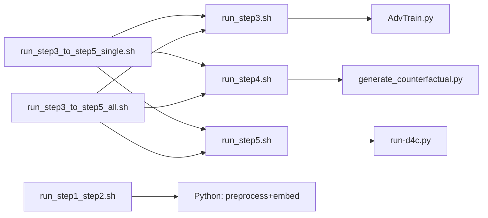

# D4C：`sh/` 脚本用法速查

本文档依据 `sh/` 目录下各 `.sh` 源码与 `[脚本参数说明 copy.md](脚本参数说明%20copy.md)` 整理；**参数与行为以脚本源码为准**。若与 `脚本参数说明 copy.md` 冲突（例如 `run_step5.sh` 源码中**无** `--gpus` 解析），以本文对源码的说明为准。

**工作目录约定（通用）**：所有脚本均通过 `BASH_SOURCE` 解析 `D4C_ROOT`（项目根目录），再 `cd` 到 `code/`。因此可从**任意当前工作目录**调用，只要传入脚本的**路径正确**即可。推荐在**项目根目录**执行：`bash sh/<脚本名>.sh ...`。若在 `sh/` 目录内，也可：`bash ./<脚本名>.sh ...`（等价）。

---

## `checkpoints/` 与 `log/` 路径（全局）

根目录均在 **项目根** `<D4C_ROOT>` 下：权重与反事实在 `**checkpoints/`**，运行日志在 `**log/**`。`<D4C_ROOT>` 默认为 `code/` 的上一级；可用环境变量 `**D4C_ROOT**` 指向其它克隆位置（须与数据、`pretrained_models` 等相对关系一致）。

**单任务子目录（Step 3 / 4 / 5 共用同一套规则）由 `code/paths_config.py` 中的 `get_checkpoint_task_dir(task)` 与 `get_log_task_dir(task)` 决定，二者对称**：把下面表里的根从 `checkpoints/` 换成 `**log/`** 即得日志目录（`task` 为 `1`–`8`）。


| `D4C_CHECKPOINT_GROUP` | `D4C_CHECKPOINT_SUBDIR` | `checkpoints/<task>/…`（`log/<task>/…` 同理） |
| ---------------------- | ----------------------- | ----------------------------------------- |
| 空                      | 空                       | `checkpoints/<task>/`                     |
| 空                      | 非空                      | `checkpoints/<task>/<SUBDIR>/`            |
| 非空                     | 空                       | `checkpoints/<task>/<GROUP>/`             |
| 非空                     | 非空                      | `checkpoints/<task>/<GROUP>/<SUBDIR>/`    |


**典型文件**：训练权重 `**model.pth`**；Step 4 生成的反事实表 `**factuals_counterfactuals.csv**`，均在上述「单任务 checkpoint 目录」内（由 `AdvTrain.py` / `run-d4c.py` / `generate_counterfactual.py` 写入）。

**各脚本的默认环境变量（未手动 export 时）**

- `**run_step3.sh`**：自动设置 `D4C_CHECKPOINT_GROUP=step3`、`D4C_CHECKPOINT_SUBDIR=step3_<时间戳>`，对应例如 `checkpoints/2/step3/step3_20250320_1430/model.pth`；与之对齐的 `**run.log**` 为 `log/2/step3/step3_20250320_1430/run.log`（前台或单任务 `--daemon` 时 `tee` 与 `--log_file` 均指向该文件）。
- `**run_step5.sh**`：若未预先设置 `D4C_CHECKPOINT_SUBDIR`，则自动 `SUBDIR=step5_<时间戳>`、`GROUP=step5`；`**--eval-only**` 时**不会**自动建目录，须先 `**export D4C_CHECKPOINT_SUBDIR=…`**（及按需 `**D4C_CHECKPOINT_GROUP**`）指向已有训练目录，否则脚本退出。

`**log/` 的两种用法**

1. **与 checkpoint 分层一致**：Step 3、Step 5 在**非**「`--all` + `--daemon`」时，主日志为 `**log/<task>/…/run.log`**（路径随当前 `GROUP`/`SUBDIR` 变）。
2. **扁平汇总文件**（均在 `**log/`** 根下，不按 task 分子目录）：例如 `step1_step2_*.log`、`step4_*.log`、`step3_daemon_*.log`、`step5_daemon_*.log`、`step3_to_5_all_*.log`、`step3_to_5_taskN_*.log` 等；用于 Step 1+2、Step 4、串联脚本整段 `tee`，或 Step 3/5 在 `**--all --daemon**` 时的终端汇总。

**可选**：设置 `**D4C_MIRROR_LOG=1`** 时，部分 Python 结构化日志可额外镜像到 `**code/log.out**`（见 `paths_config.append_log_dual`）；与 `run.log` 路径相同时不会重复写入。

---

## 范围一览（每个文件一行）


| 文件名                            | 用途                                                   |
| ------------------------------ | ---------------------------------------------------- |
| `run_step1_step2.sh`           | Step 1+2：数据预处理与嵌入、域语义（`run_preprocess_and_embed.py`） |
| `run_step3.sh`                 | Step 3：域对抗预训练与评估（`torchrun` + `AdvTrain.py`，DDP）     |
| `run_step4.sh`                 | Step 4：生成反事实数据（`generate_counterfactual.py`）         |
| `run_step5.sh`                 | Step 5：主训练与评估（`torchrun` + `run-d4c.py`，DDP）         |
| `run_step3_to_step5_single.sh` | 单任务串联：Step 3 → 4 → 5（内部调用上述三个脚本）                     |
| `run_step3_to_step5_all.sh`    | 任务 1–8 批量串联：每任务 Step 3 → 4 → 5（内部调用上述三个脚本）           |


---

## `run_step1_step2.sh`

**说明摘录（文件头）**：Step 1 + Step 2 合并；数据预处理 + 嵌入与域语义。用法：`bash run_step1_step2.sh [--embed-batch-size N] [--gpus 0,1] [--daemon|--bg]`。`--daemon` / `--bg`：后台运行，日志写入 `log/step1_step2_*.log`。

**必填 / 可选**


| 类型  | 参数                                                      |
| --- | ------------------------------------------------------- |
| 必填  | 无（可零参数运行）                                               |
| 可选  | `--embed-batch-size N`、`--gpus 0,1`、`--daemon` / `--bg` |


与 `[脚本参数说明 copy.md](脚本参数说明%20copy.md)` 中「run_step1_step2」一致。

**调用关系**：不调用其它 `sh/` 脚本；直接执行 `code/run_preprocess_and_embed.py`。

**一键复制运行**（假定当前目录为项目根 `D4C-main`）

```bash
bash sh/run_step1_step2.sh
```

```bash
bash sh/run_step1_step2.sh --embed-batch-size 512
```

```bash
bash sh/run_step1_step2.sh --embed-batch-size 1024 --gpus 0,1
```

```bash
bash sh/run_step1_step2.sh --daemon
```

---

## `run_step3.sh`

**说明摘录（文件头）**：Step 3 域对抗预训练（`torchrun` + DDP）。要点：`--task N` 与 `--all` 二选一；`--eval-only` 仅跑 eval；`--from` / `--skip` 仅配合 `--all`；`--ddp-nproc` 或环境变量 `DDP_NPROC`（默认 2）；`--gpus` 在脚本内 train/eval 走 torchrun DDP 时会被忽略并提示，请用环境变量 `CUDA_VISIBLE_DEVICES`。NLTK 数据目录由脚本设为 `D4C_ROOT/pretrained_models/nltk_data`。

**必填 / 可选**


| 类型  | 参数                                                                                                                                                |
| --- | ------------------------------------------------------------------------------------------------------------------------------------------------- |
| 必填  | `--all` **或** `--task N`（N 为 1–8）                                                                                                                 |
| 可选  | `--eval-only`、`--from N`（仅 `--all`）、`--skip N,M,...`、`--batch-size`、`--epochs`、`--num-proc`、`--ddp-nproc K`、`--gpus`（会被忽略，见上）、`--daemon` / `--bg` |


与 `[脚本参数说明 copy.md](脚本参数说明%20copy.md)` 中「run_step3」一致。

**调用关系**：不调用其它 `sh/` 脚本。

**一键复制运行**

```bash
bash sh/run_step3.sh --task 1
```

```bash
DDP_NPROC=1 bash sh/run_step3.sh --task 2
```

```bash
CUDA_VISIBLE_DEVICES=0,1 DDP_NPROC=2 bash sh/run_step3.sh --task 2 --batch-size 1024
```

```bash
bash sh/run_step3.sh --all --from 4
```

```bash
bash sh/run_step3.sh --task 5 --eval-only
```

```bash
bash sh/run_step3.sh --all --daemon
```

---

## `run_step4.sh`

**说明摘录（文件头）**：Step 4 生成反事实；需先有 Step 3 checkpoint。多卡为 `generate_counterfactual` 内 DataParallel，非 DDP。`--daemon` / `--bg`：日志 `log/step4_*.log`。

**必填 / 可选**


| 类型  | 参数                                                                                                  |
| --- | --------------------------------------------------------------------------------------------------- |
| 必填  | `--all` **或** `--task N`（1–8）                                                                       |
| 可选  | `--from N`（仅 `--all`）、`--skip N,M,...`、`--gpus 0,1`、`--batch-size`、`--num-proc`、`--daemon` / `--bg` |


与 `[脚本参数说明 copy.md](脚本参数说明%20copy.md)` 中「run_step4」一致。

**调用关系**：不调用其它 `sh/` 脚本；执行 `code/generate_counterfactual.py`。

**一键复制运行**

```bash
bash sh/run_step4.sh --task 2
```

```bash
bash sh/run_step4.sh --all --from 4
```

```bash
bash sh/run_step4.sh --all --skip 2,5 --gpus 0,1
```

```bash
bash sh/run_step4.sh --task 2 --batch-size 64
```

```bash
bash sh/run_step4.sh --all --daemon
```

---

## `run_step5.sh`

**说明摘录（文件头）**：Step 5 主训练与评估；`torchrun` + `run-d4c.py`。`DDP_NPROC` 或 `--ddp-nproc`（默认 2）；须与可见 GPU 数一致；全局 batch 须能被 `DDP_NPROC` 整除。`**--eval-only`**：只跑 valid 上的最终评估（`run-d4c.py --eval-only`），不训练；须已有 `**model.pth**`。若未设置 `**D4C_CHECKPOINT_SUBDIR**`，脚本会拒绝 `--eval-only`（避免新建时间戳子目录却找不到权重）；请先 `**export D4C_CHECKPOINT_SUBDIR=…**`（及按需 `**D4C_CHECKPOINT_GROUP**`）指向**已有训练目录**；也可用 Python 侧 `**--save-file`** 指定权重路径（见 `run-d4c.py`）。`--eval-only` 时不自动补默认 `**--epochs**`。`--all --daemon` 且仅 eval 时，汇总日志文件名为 `**step5_eval_daemon_*.log**`。

**必填 / 可选**


| 类型  | 参数                                                                                                                              |
| --- | ------------------------------------------------------------------------------------------------------------------------------- |
| 必填  | `--all` **或** `--task N`（1–8）                                                                                                   |
| 可选  | `--eval-only`、`--from N`（仅 `--all`）、`--skip N,M,...`、`--batch-size`、`--epochs`、`--num-proc`、`--ddp-nproc K`、`--daemon` / `--bg` |


与 `[脚本参数说明 copy.md](脚本参数说明%20copy.md)` 中「run_step5」一致。

**注意**：源码中**没有** `--gpus` 解析；多卡请用环境变量 `**CUDA_VISIBLE_DEVICES`**，并配合 `**DDP_NPROC` / `--ddp-nproc**`（与 `[脚本参数说明 copy.md](脚本参数说明%20copy.md)` 将 Step 3/5 合并描述时略有出入，以本脚本为准）。

**调用关系**：不调用其它 `sh/` 脚本。

**一键复制运行**

```bash
bash sh/run_step5.sh --task 2
```

```bash
DDP_NPROC=1 bash sh/run_step5.sh --task 2
```

```bash
CUDA_VISIBLE_DEVICES=0,1 DDP_NPROC=2 bash sh/run_step5.sh --all --batch-size 1024
```

```bash
bash sh/run_step5.sh --task 2 --batch-size 64 --epochs 30
```

```bash
bash sh/run_step5.sh --all --daemon
```

```bash
# 仅评估：须先指向已有 Step 5 训练目录（与当时训练时 GROUP/SUBDIR 一致）
export D4C_CHECKPOINT_GROUP=step5
export D4C_CHECKPOINT_SUBDIR=step5_20250320_1430
CUDA_VISIBLE_DEVICES=0,1 DDP_NPROC=2 bash sh/run_step5.sh --task 3 --eval-only --daemon
```

---

## `run_step3_to_step5_single.sh`

**说明摘录（文件头）**：单任务顺序执行 Step 3 → 4 → 5。`--from 3|4|5` 可从指定步续跑；`**--eval-only`** 时 **Step 3** 与 **Step 5** 均只 eval（内部传子脚本的 `--eval-only`），**Step 4** 仍会执行；须分别为 Step 3 / Step 5 准备好 checkpoint（Step 5 在仅跑 Step 5 时需 `**D4C_CHECKPOINT_SUBDIR`** 等，见上）。`--gpus` 主要给 Step 4；Step 3/5 为 `torchrun` DDP，见 `run_step3.sh` / `run_step5.sh`。

**必填 / 可选**


| 类型  | 参数                                                                                                                       |
| --- | ------------------------------------------------------------------------------------------------------------------------ |
| 必填  | `--task N`（1–8）                                                                                                          |
| 可选  | `--from 3|4|5`（默认从 3 开始）、`--eval-only`、`--gpus`、`--batch-size`、`--epochs`、`--num-proc`、`--ddp-nproc`、`--daemon` / `--bg` |


与 `[脚本参数说明 copy.md](脚本参数说明%20copy.md)` 中「run_step3_to_step5_single」一致。

**调用关系**：依次调用 `run_step3.sh`、`run_step4.sh`、`run_step5.sh`（**不要**再单独跑同任务的这三个脚本，除非刻意分段重跑）。

**一键复制运行**

```bash
bash sh/run_step3_to_step5_single.sh --task 2
```

```bash
DDP_NPROC=1 bash sh/run_step3_to_step5_single.sh --task 2
```

```bash
CUDA_VISIBLE_DEVICES=0,1 DDP_NPROC=2 bash sh/run_step3_to_step5_single.sh --task 2 --batch-size 1024
```

```bash
bash sh/run_step3_to_step5_single.sh --task 2 --from 4
```

```bash
bash sh/run_step3_to_step5_single.sh --task 2 --daemon
```

```bash
# 串联下仅 eval Step 3 与 Step 5（Step 4 仍跑）；Step 5 前请 export 指向已有 step5 目录
export D4C_CHECKPOINT_GROUP=step5
export D4C_CHECKPOINT_SUBDIR=step5_20250320_1430
bash sh/run_step3_to_step5_single.sh --task 2 --eval-only
```

---

## `run_step3_to_step5_all.sh`

**说明摘录（文件头）**：对任务 1–8（可由 `--from` / `--skip` 缩小）每个任务执行 Step 3 → 4 → 5。`**--eval-only`** 时每个任务的 **Step 3** 与 **Step 5** 均只 eval（子脚本均带 `--eval-only`），**Step 4** 不变；批量 Step 5 仅 eval 前请 `**export D4C_CHECKPOINT_SUBDIR=…`**（及按需 `**D4C_CHECKPOINT_GROUP**`）指向与各任务一致的已有训练子目录。`**--gpus**` 传给 Step 3/4 相关子脚本；Step 5 子调用不传 `**--gpus**`（与 `**run_step5.sh**` 一致）。

**必填 / 可选**


| 类型  | 参数                                                                                                                          |
| --- | --------------------------------------------------------------------------------------------------------------------------- |
| 必填  | 无单独模式开关；默认覆盖任务 1–8（受 `--from` / `--skip` 约束）                                                                                |
| 可选  | `--from N`、`--skip N,M,...`、`--eval-only`、`--gpus`、`--batch-size`、`--epochs`、`--num-proc`、`--ddp-nproc`、`--daemon` / `--bg` |


与 `[脚本参数说明 copy.md](脚本参数说明%20copy.md)` 中「run_step3_to_step5_all」一致。

**注意**：源码中 `*) shift ;;` 会**静默丢弃**未知参数（见 `[脚本参数说明 copy.md](脚本参数说明%20copy.md)` 第一节）。

**调用关系**：循环内调用 `run_step3.sh`、`run_step4.sh`、`run_step5.sh`（**不要**与单任务串联脚本对同一任务重复全套执行）。

**一键复制运行**

```bash
bash sh/run_step3_to_step5_all.sh
```

```bash
DDP_NPROC=1 bash sh/run_step3_to_step5_all.sh
```

```bash
CUDA_VISIBLE_DEVICES=0,1 DDP_NPROC=2 bash sh/run_step3_to_step5_all.sh --ddp-nproc 2 --batch-size 1024
```

```bash
bash sh/run_step3_to_step5_all.sh --from 4 --skip 2,5
```

```bash
bash sh/run_step3_to_step5_all.sh --daemon
```

```bash
# 每任务 Step 3 + Step 5 仅 eval（Step 4 仍跑）；SUBDIR 需与各任务已有 step5 产物一致
export D4C_CHECKPOINT_GROUP=step5
export D4C_CHECKPOINT_SUBDIR=step5_20250320_1430
bash sh/run_step3_to_step5_all.sh --eval-only
```

---

## 总览表


| 脚本名                            | 一句话用途              | 最常用的一条命令（单行）                                    |
| ------------------------------ | ------------------ | ----------------------------------------------- |
| `run_step1_step2.sh`           | 预处理 + 嵌入与域语义       | `bash sh/run_step1_step2.sh`                    |
| `run_step3.sh`                 | 域对抗预训练 / eval（DDP） | `bash sh/run_step3.sh --task 1`                 |
| `run_step4.sh`                 | 生成反事实              | `bash sh/run_step4.sh --task 1`                 |
| `run_step5.sh`                 | 主训练与评估（DDP）        | `bash sh/run_step5.sh --task 1`                 |
| `run_step3_to_step5_single.sh` | 单任务 Step 3→4→5     | `bash sh/run_step3_to_step5_single.sh --task 1` |
| `run_step3_to_step5_all.sh`    | 全任务 Step 3→4→5     | `bash sh/run_step3_to_step5_all.sh`             |


---

## 脚本调用关系简图




独立跑流水线时：先用 `run_step1_step2.sh`，再按需使用 Step 3/4/5 或串联脚本。